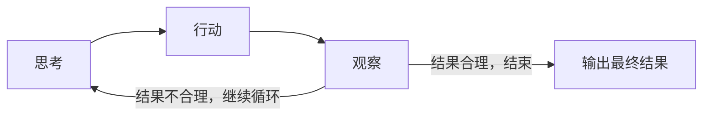

# 欢迎来到Agent时代

软件不再仅仅是对人类指令的响应，而是而是在理解意图、自主思考与规划、参与讨论、提供建议。它更像一位经验丰富的同事，并能够从经验中持续学习。

代码不再是控制的指令，而是孕育智能的土壤。

## 1. 从工具到伙伴

### 1.1 人类模糊的自然语言与机器精确的API调用之间的桥

1. 提取用户表达背后的动作、对象、范围和限制条件
2. 不仅要理解你说什么，更要理解你想实现什么
3. Agent必须基于当前上下文状态进行判断和决策
   + 用户的代码结构。
   + 当前文件目录。
   + 用户偏好（例如，倾向于使用yield语句还是列表推导式）。
   +  安全约束（例如，禁止删除系统文件）
   + 历史任务上下文
4. 在意图模糊时主动提问，而非贸然执行，以避免误操作，这样既确保任务能够准确完成，又符合安全策略。

### 1.2 记忆与身份：Agent的自我连续性

Agent在每次对话之间延续其“身份”，并逐渐形成对用户的深入理解。

+ 短期记忆

  记录当前会话的上下文，包括用户上一句话的内容、最近讨论的话题、代码片段，以及用户此前纠正过的误解等。

+ 长期记忆

  借助向量数据库等技术，记录用户跨会话的偏好信息，目前`claude-mem`架构已将长期记忆实现为可建模、可检索、可索引的形式，使Agent能够像人类一样“内化知识。

+ 身份`System Prompt`

  无形的概率模型便塑造成一个具备一套价值观与行为准则集合的具体人格

  + 表达风格
  + 专业领域定位
  + 价值观倾向
  + 行动策略偏好

### 1.3 根据上下文理解用户信息

LLM本身并不具备主动感知世界的能力，它只能依据上下文进行推理。因此，对任何Agent而言，输入的是垃圾，输出的也必然是垃圾。Agent失败的主要原因，往往并非模型的能力不足，而是上下文信息提供有误。

+ 输入不完整，推理就会偏离目标。
+ 输入过多，模型难以抓住重点。
+ 输入结构混乱，模型容易迷失方向。

**上下文工程目标：**将Agent完成任务所需的最关键信息，以最合适的结构提供给模型。

1. **用户上下文**：用于理解用户及工作特点
   + 开发风格
   + 历史偏好
   + 常用技术栈
   + 当前工作内容
2. **环境上下文**：用于理解用户状态
   + 文件结构
   + 代码库内容
   + 当前分支
   + 日志
3. **任务上下文**：
   + 前一个任务的结果
   + 当前子任务的进度
   + 依赖项是否已加载
   + 以及工具调用的历史尝试记录

**优化上下文**：聚焦问题、突出关键信息、降低干扰

+ 选择性上下文：精准筛选与当前意图紧密相连的内容，剔除无关信息，聚焦关键要素。
+ 结构化摘要：针对历史内容生成结构化摘要，包括标题、关键发现和失败点等核心要素。
+ 图结构上下文：将知识库构建为图结构，并依据节点重要性进行检索。
+ 上下文优先级排：由模型自主判断不同内容的权重高低。

### 1.4 分解任务，将目标变为计划

任务分解赋予了Agent将“目标”转化为具体执行步骤的能力，是衡量其智能化水平的关键指标

+ 规划(Planning)：将总体目标拆解为若干子目标。
+ 映射(Mapping)：将每个子目标转化为具体的行动或可调用的工具。

在工具时代，复杂度的负担主要落在人身上。用户必须在脑海中将“修复bug”这一目标拆解为“定位文件→修改代码→运行测试”等多个步骤，并依次手动执行。在Agent时代，这一认知负担被转移到机器身上。

**规划**

1. **理解**：将模糊的高层目标转化为真实、明确的需求。

2.  **规划**：目标转化为清晰、可执行的流程，并生成可操作对应落地方案。

   + 规划后要学会自我审查，潜在错误在执行前就被识别和修正，从而避免在运行时酿成不可逆的事故。

3. **执行与反思**：Agent在执行完第一步后，可能基于新信息主动调整计划

   包括工具调用、失败重试、异常处理、结果验证，以及向用户汇报进度和动态调整计划

#### 1.5 核心循环

工具调用、子任务完成并非孤立的事件，而是推理链条中的关键一环。Agent会根据工具、子任务的返回结果动态调整后续行动。

**思考**→**行动**→**观察**：它不再依赖一次性给出完美答案，而是通过与环境的持续交互，逐步逼近正确的解决方案。

