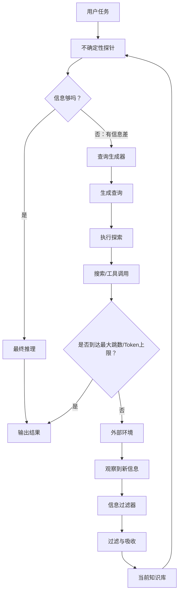

# 1. 主动感知模式

模型天然假设人类交给我的输入是真实且完备的，因此不会质疑Prompt的来源、可靠性和偏差，而是基于已有内容尽力补齐推理链条。因此，模型常常会在“必须给出答案的内在压力下产生幻觉。

Agent从被动的答题者转变为主动的调查员。当Agent发现现有信息不足以支撑可信结论时，它会暂停生成答案，转而执行操作以获取新证据。

## 1.1 信息觅食环

**不确定性探针**：不负责生成内容，只负责判断能不能回答。

**查询生成器**：负责将模糊的知识缺口转换为具体的工具指令。

**信息过滤器**：主动找回的信息往往包含大量噪声，为了防止污染上下文，必须有一个过滤层，只将通过校验的“事实”写入短期记忆。

**预算控制器**：为了防止Agent陷入搜索—失败—再搜索”的死循环，必须设置最大跳数或Token消耗上限。

## 1.2 核心机制

+ 何时停：停止感知，开始回答
+ 去哪找：路径规划

### 1.2.1 触发机制

因为成本太高，我们不能对所有请求都开启主动感知。系统需要识别“认识论不确定性

**认知触发**

+ 当用户查询包含查询、分析等动词时，需要显式触发自动感知
+ 若模型在尝试回答时发现缺失关键实体，需要隐式触发自动感知。此时应在System Prompt中加入Prompt：“如果你不知道答案，请输出具体问题，而不是编造。

**进式信息觅食**

+ **退一步：**如果问题太具体导致查不到，Agent应主动生成一个更宽泛的查询，先获取大文档。
+ **深一点：**获取大文档后，不再进行搜索，而是通过机器阅读理解精确定位具体数值。

| 阶段 | 核心问题         | 典型行为               | 代表技术                   |
| ---- | ---------------- | ---------------------- | -------------------------- |
| 探索 | 哪里可能有答案？ | 广撒网式搜索、浏览目录 | 广度优先搜索、关键词扩展   |
| 定位 | 具体在哪一行？   | 点击链接、精准查询     | 点击预测、文档对象模型解析 |
| 利用 | 这是我要的吗？   | 阅读内容、提取事实     | 深挖一步                   |

**警惕**

1. 上下文污染：Agent搜索到一篇错误的博客文章，并将其作为事实依据，最终导致回答错误。

   > 在写入上下文之前，引入交叉验证机制。

2. 注意力发散：被无关信息吸引，跑题了

   > 对策是始终将用户的原始问题钉在Prompt的最下方，提醒Agent勿忘“初心

3. 非必要的昂贵调用：用户问的是简单问题，Agent却调用了一次Google Search

   > 引入一个极低成本的Router模型（如Qwen开源小型模型或规则引擎）作为前置网关，拦截闲聊和通用常识问题。