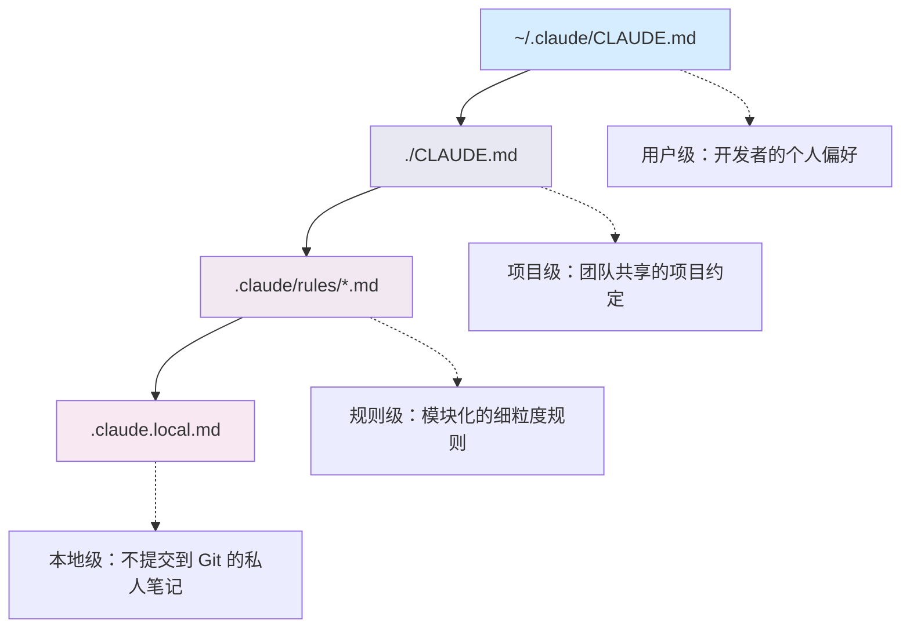

# 记忆系统

## 1. 概述

Claude.md 本质是给AI的一份员工手册，每次对话启动时候，都能加载到Claude的上下文中




 这种分级设计与`CSS`的层叠优先级机制`全局—>用户—>项目—>本地`如出一辙，，每一级均可覆盖上一级的设定。

>这一看似简单的机制，实则是整个框架的基石。上层的Skills、 Commands、Hooks等所有配置与行为，均构建于Claude对项目上下文 的精准理解之上。恰如建筑地基虽不如外墙装饰般醒目，但若缺了它, 一切装饰都将无从依附。

+ 规则级别：在`claude/rules`下部署多个独立的markdown文档，每个文件专注于一个特定的主题。规则文件仅在操作特定文件或进入特定上下文中才会被被动加载。避免无关信息对上下文的占用。
+ 本地级：`.claude.local.md`，不会被提交到git仓库，专门为那些极具个人价值但不宜被共享的信息而设，或是临时性的工作备忘录。


>`claude.md`还内置了强大的**文件引用机制**，在任何层级的记忆文件中，均可使用 @path/to/file 的语法引用其他文件，从而实现配置的模块化组织

## 1.1  Claude.md

**注意：**`claude.md`，每一次对话初始化的时候都会被完整的注入上下文中，这意味着消耗token配额。不宜超过100行，否则指令月冗长繁杂，其被遵循的该乱就越低。

> `CLAUDE.md`应被视为核心代码，纳入严格的代码审查流程，将专业领域的详细知识迁移至Skills模块。

### 1.1.1 写好Claude.md

**理念**

1. **Why，为什么这样做？**：赋予模型举一反三的推理能力

   揭示决策底层逻辑，让模型也会基于此正确推导。

   > 为什么我选择技术栈一，而不是技术栈二，因为技术栈一的某些特性与本项目"类型安全优先"的战略一致。
   
   Claude理解了类型安全的优先级之后，后续也会主动倾向与选择类型定义风完善的方案。而非机械的匹配关键词。
   
2. **What，no What，做什么、不做什么？**：划定红线，确保一致性

3. **How,如何一步步去做？**：固化标准作业程序

4. **精简，才是高效协作的王道**

   你发现在自己的CLAUDE.md中，每一条规则后面都附带了一大段背景阐述、客套话、模糊指令、正确废话，那通常意味着内容过载了。
   

**具体**

| 原则                                       | 避免                                                   |
| :----------------------------------------- | :----------------------------------------------------- |
| **无法推测**：构建、测试及部署的具体指令   | **可推导信息**：大模型通过阅读代码即可自行推断的内容   |
| **实现规范**：与默认设置不同的代码风格规则 | **通用惯例**：标准的语言规范（大模型已内置相关知识）   |
| **架构约束**：项目特有的架构决策与设计限制 | **易变信息**：频繁变动的内容                           |
| **环境要求**：开发环境的特殊配置           | **文件详述**：代码文件的详细描述（应交由搜索工具处理） |
| **避坑指南**：常见陷阱及不易察觉的系统行为 | **空泛建议**：如“编写整洁代码”等不言自明的原则         |


**示范**

```
# 订单服务 API

## 技术栈

- Node.js 20 + TypeScript 5.3（严格模式）
- Fastify 4 框架（不使用 Express）
- Prisma ORM + PostgreSQL 15
- pnpm 8 包管理（不使用 npm/yarn）

## 项目结构

- src/routes/ — 路由定义，只做参数解析和响应构造
- src/services/ — 业务逻辑层，所有核心逻辑在此
- src/repositories/ — 数据访问层，封装 Prisma 调用
- src/schemas/ — Zod 验证 schema，与路由一一对应

## 关键约定

- API 统一返回格式：{ success: boolean, data?: T, error?: { code: string, message: string } }
- 错误码使用 UPPER_SNAKE_CASE，如 ORDER_NOT_FOUND
- 数据库表名 snake_case 复数形式，主键 UUID，必带 created_at 和 updated_at

## 常用命令

pnpm dev           # 启动开发服务器，端口 3000
pnpm test          # 运行全部测试（vitest）
pnpm build         # TypeScript 编译 + 类型检查
pnpm db:migrate    # 执行 Prisma 数据库迁移
```

+ 简洁、具体且具备高度可操作性，每一条规则都能直接锚定Claude模型的行为逻辑。
+ 技术栈锁定
+ 架构规范落地：Claude能精准判断新路由文件应置于什么目录下，而非随意堆砌。

**命令**

`/init` 生成一份CLAUDE.md初稿,是一个起步的基础，但需要手动审查并补充：分层架构的具体约束、API响应格式的统一约定、团队特有的命名规范等

`/memory`执行该命令后，Claude Code会弹出文件选择器，列出当前所有可用的记忆文件供你选择编辑，**重新启动对话生效**


## 1.2 规则文件 Rules

它将记忆系统从“一本大而全的厚重手册”进化为“一个按需取用的模块化知识库。在多人协作场景下，各领域专家可独立维护其专属规则文件。

- 无 paths 的规则：全局规则，启动时一次性完整加载到上下文窗口。
- 带 paths 的规则：路径规则，启动时仅解析 paths 元数据；当操作匹配 paths。

```
---
paths:
  - "prisma/**"
  - "src/repositories/**"
---

# 数据库规范
- 迁移文件一旦提交至main分支，严禁修改，仅允许创建新迁移
- 所有查询必须经由repository层，service层禁止直接调用Prisma客户端
- 批量操作必须包裹在事务中，单次写入超过100条记录时强制分批处理
```


**优先级**

> 1.  用户当前消息 — 最高，可覆盖一切
>
>   2. .claude/CLAUDE.md 或根目录 CLAUDE.md — 项目级主体指令
>   3. .claude/rules/*.md （含带/不带 paths）— 辅助性规则
>   4. 默认 system prompt — 最低

****

## 1.3 实战

### 1.3.1 前端

**核心：**组件粒度划分、状态归属以及样式方案选择往往是分歧的“重灾区，Claude极有可能在同一项目中混用不同的语法规范，造成架构混乱。

不仅仅要罗列技术栈名称，而是构建了“场景到工具的映射逻辑”。这种“决策指导”远比单纯的工具清单有效得多——它直接告诉Claude在遇到具体问题时“该选哪把钥匙”，从而在源头上杜绝了架构风格的漂忽问题。

### 1.3.2 后端

**核心：**分层架构的职责边界与数据格式的统一，这绝非单纯的代码风格偏好，而是一条不可逾越的架构铁律。如果各层级之间引用混乱，往往导致后续维护陷入泥潭。

### 1.3.3 总结

在Claude中，你不需要向它解释什么是React，也不必赘述代码的缩进规则

1. 精准聚焦于特定领域与本项目独有的约定和抉择
2. 只记录那些Claude必须知晓、却无法自行推断的关键信息。

**准则：** 如果删去某条规则后，Claude依然能做出正确的行为，那么这条规则不该出现在CLAUDE.md中。

+ 必要性：每一条都是Claude必须知道且无法自行推断的信息。
+ 可操作性：每一条都是具体、明确且可执行的指令。
+ 脆弱性测试：每一条若被删去，都会直接导致Claude犯错或偏离预期。

