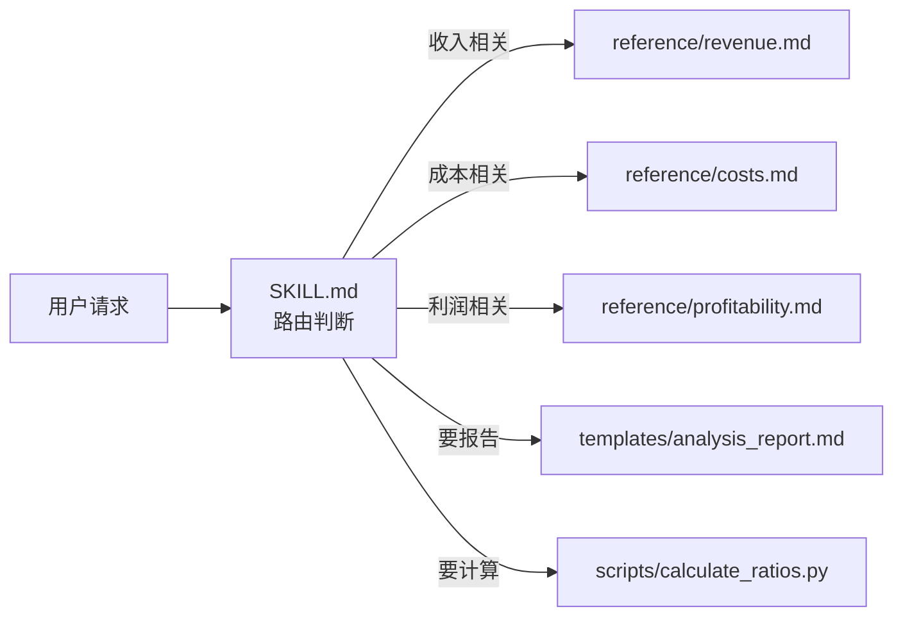
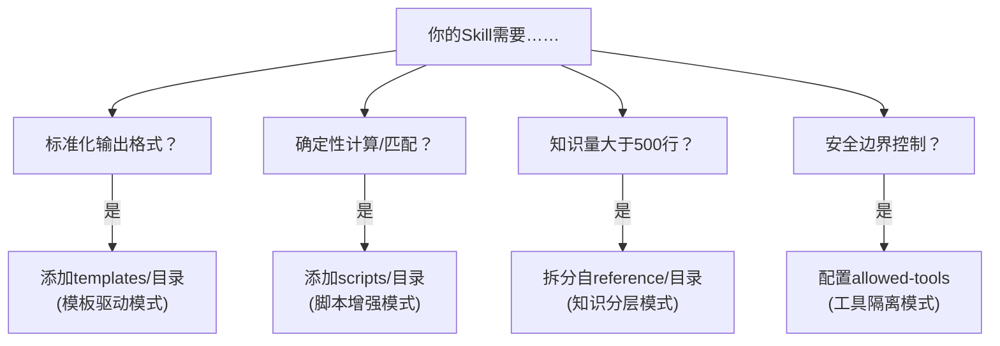

# Skill 工程

**定义：**一个Skill是一个包含指令的文件夹，被打包成一个简单的工程化目录结构

+ 可以容纳复杂的代码库、详尽的领域文档、多样的模板，甚至可执行的脚本。
+ 让Claude真正理解了一个领域的运作逻辑。它不再是被动执行指令的工具，而是变成了该领域的“熟手”。

```
skill-name/
├── SKILL.md          # 必需文件：技能元数据 + 执行指令
├── scripts/          # 可选目录：可执行脚本代码
├── references/       # 可选目录：参考文档、资料
├── assets/           # 可选目录：模板、静态资源文件
└── ...               # 其他自定义文件/目录
```


# 1. yaml 元数据：Skill的身份证

```yaml
---
name: api-doc-generator
  # 唯一标识符，最多 64 字符
  # 省略时使用目录名

description: Generate API documentation from source code. Use when
  the user asks to "write API docs", "document endpoints", or
  "create OpenAPI specs". Supports Express, FastAPI, and Spring Boot.
  # 触发描述，最多 1024 字符

argument-hint: "[source directory] [output format]"
  # 参数提示，在 / 菜单中显示
  # 帮助用户了解该 Skill 接受什么输入、调用方式
  
license: Apache-2.0 # 许可证名称

# 在你的技能有特定环境要求时才应该包含
compatibility: Requires Python 3.14+ and uv
metadata:
  # 任意键值映射以获取额外元数据。
  author: example-org
  version: "1.0"

disable-model-invocation: true   # 默认：false
  # 为 true 时 Claude 不能自动调用
  # 只能由用户通过 /skill-name 手动触发


user-invocable: false  # 默认：true
  # 为 false 时从 / 菜单中隐藏，Claude 仍可自动调用
 

allowed-tools:
  - Read
  - Grep
  - Glob
  - Write
  - Bash(python:*)
  # 工具白名单，精确控制 Skill 执行时的能力边界

model: haiku
  # 指定该 Skill 使用的模型
  # 简单任务用 haiku 更快更省

context: fork
  # 设为 fork 时在隔离的子智能体中执行，不会污染主对话上下文

agent: Explore
  # 当 context: fork 时指定子智能体类型
  # 选项：Explore、 Plan、general-purpose 或自定义 Agent
  
  // Explore:侧重代码 / 文件检索、读取、全局扫描,无修改操作
  // Plan:规划执行型 Agent，可读可写，带任务调度、分步执行逻辑,擅长落地操作、修改代码、执行测试
  // general-purpose:仅基础读写，通用问答、简单分析场景使用

hooks:
  PreToolUse:
    - matcher: Bash
      hooks:
        - command: echo "$TOOL_INPUT" >> audit.log
  # Skill 生命周期内的事件钩子
  # 仅在 Skill 激活期间生效
---

```

所有Skill的`description`，都是以常驻方式注入Claude上下文中的，创建Skill要追求**少而精**的架构设计。当你发现需要安装超过20个Skill时，这通常是一个信号，提示你需要重新审视架构策略。

+ 合并同类项。将多个零碎的Skill合并为一个综合性的Skill。
+ disable-model-invocation: true，减少对预算的占用。
+ 采取“Token投资”回报率思维。将description中的每一个字符视为一笔昂贵的“Token投资


**name：**命名规则

- 必须是1到64个字符
- 可能仅包含 Unicode 小写字母数字字符（， ）和连字符（`a-z``0-9``-`)
- 不得以连字符开头或结尾 （`-`)
- 不得包含连续的连字符（`--`)
- 必须与父目录名称匹配


## skill 调用skill、agent

<span style="color:red;">以下两种说法待确认？</span>

```
1. 调用 @code-check 检查代码格式、语法和明显错误。
2. 调用 code-reviewer进行深度审查，关注安全性、性能、可维护性、正确性和测试覆盖。
```

```
1. 使用名为`code-check` 的 skill 检查代码格式、语法和明显错误。
2. 使用名为`code-reviewer` 的代码审查 agent 进行深度审查，关注安全性、性能、可维护性、正确性和测试覆盖。
```


## 2. 触发机制

激活方式

+ 显式调用：`/skill-name`
+ 语义匹配：根据skill的`Description`动态调用


**优先级**

> 个人配置(`~/.claude/skill`) > 项目配置(`.claude/skill`) > `Plugin`内置

### 2.1 description

语义匹配机制完全依赖于description字段，是Claude在决策“是否调用此Skill”时所依据的唯一信号。不能超过1024字符

```
+ 功能定义（做什么）
+ 触发场景（何时用）
+ 核心能力（能做什么）
+ 排除范围（不能做什么，防止乱触发）
```

> 为了提升触发准确率，你必须在description中穷尽用户可能使用的各种表达方式。
>
> 例如，针对“生成`API`文档”这一需求，用户可能会说“生成`API`文档”、“编写接口文档”、“输出`OpenAPI`规范”、“帮我写个Swagger”。这些不同的表述都应显式地包含在description中。同义词库越丰富，语义匹配的覆盖面就越广，触发的准确率也就越高。

**欠触发**和**过度触发**，都是不好现象 。针对相关任务触发率，应达到90%以上，针对无关任务误触发率，应控制在5%以下。

**应该触发的测试用例：**

> **重点：**该技能会有帮助，但仅凭查询同技能联系不明显的

**不应该触发的测试用例：**

> **重点：**那些与你技能共享关键词或概念，但实际上不需要调用该技能的


## 3. Skill正文

### 3.1 skill类型

| 维度             | 参考型 Skill                   | 任务型 Skill                         |
| ---------------- | ------------------------------ | ------------------------------------ |
| Claude 自动触发  | 能（基于语义匹配）             | 不能（必须手动）                     |
| 用户 / 触发      | 能                             | 能                                   |
| description 作用 | 触发条件（注入 Claude 上下文） | 仅供用户识别（不注入 Claude 上下文） |
| 消耗 Token 预算  | 是（自动加载即消耗）           | 否（仅手动调用时消耗）               |
| 典型场景         | 知识提供、规范查询             | 动作执行、有副作用操作               |
| 经典案例         | API 规范、审查清单             | /commit、/deploy                     |


### 3.2 正文

**定位：**Skill的定位应该为路由器而非知识仓库：文件自身仅包含核心流程与路由表，而详尽的知识内容则分散存储于被引用的文件中。

**长度：**Skill最好控制在500行以内，否则通常意味着你将**参考资料**与**路由指令**混淆了——此时的应对策略并非继续扩充内容，而是立即进行重构。




#### 3.2.1 契约引用方式

在`SKILL.md`中引用辅助文件时，切勿只罗列路径。应当建立一份明确的“契约：

+ 触发时机（何时加载）
+ 资源位置（去哪查找）
+ 预期产出（获取何物)


```yaml
# 弱引用：缺乏上下文（Claude无法判断何时该加载此文件，缺乏行动指令）
  如需更多详情，请查看 `reference/revenue.md`。


# 契约式引用：明确触发条件 + 文件路径 + 预期读取内容
## 收入分析
当用户询问收入增长、ARPU（每用户平均收入）或收入构成相关问题时：
  加载 `reference/revenue.md`，获取计算公式与行业基准数据。
```

**主文件不仅需要知道子文件的位置，更必须明确子文件能提供什么。**

| 重构信号                       | 对策                       |
| ------------------------------ | -------------------------- |
| 大段公式或规范说明             | 移至 reference/ 目录       |
| 多个完整示例（单个超过 30 行） | 移至 examples/ 目录        |
| 多个输出模板                   | 移至 templates/ 目录       |
| 可独立执行的逻辑               | 封装为 scripts/ 脚本       |
| 多个平行的功能模块             | 考虑拆分为多个独立的 Skill |

#### 3.2.2 权限设计模板

`allowed-tools`：是Skills安全架构中的核心字段。它不仅仅是一份权限清单，更体现了一项深层设计原则：知识应当约束行动。

```yaml
# 审计类 Skill：严格只读
allowed-tools:
  - Read
  - Grep
  - Glob

# 生成类 Skill：可写不可改
allowed-tools:
  - Read
  - Grep
  - Glob
  - Write

# 分析类 Skill：只读 + 特定脚本
allowed-tools:
  - Read
  - Grep
  - Glob
  - Bash(python:*)

# 执行类 Skill：受控命令
allowed-tools:
  - Read
  - Bash(git status:*)
  - Bash(git add:*)
  - Bash(git commit:*)
  - Bash(npm test:*)
  
 # 可执行bash脚本 
 allowed-tools:
  - Bash(bash ./scripts/*.sh:*) 
  - Bash(sh ./scripts/*.sh:*)

```

**Bash精细控制语法**

`Bash(prefix:*)`：其中prefix指定允许的命令前缀，通过前缀匹配机制，实现对可执行命令的细粒度管控

```yaml
# 精确授权：只明确列出任务所需的具体命令子集
# 场景：代码提交 Skill
# 策略：仅允许 status、add、commit 3个特定子命令
allowed-tools:
  - Bash(git status:*)  # 查看当前代码文件变更、暂存区状态，纯查询无修改风险
  - Bash(git commit:*)  # 仅保存在本地仓库，不会同步到远端服务器
  - Bash(git:*)         # 允许所有以git开头的子命令
  - Bash(git log:*)     # 仅允许git log及其参数，禁止git push等危险操作
  - Bash(npm test:*)    # 仅允许运行测试命令，防止误执行npm install或npm publish
  - Bash(python:*)      # 允许所有Python脚本执行
  - Bash(./scripts/*:*) # 允许执行scripts/目录下的特定脚本

# 过度授权：使用全局通配符等同放弃所有防线
# 场景：错误的通用配置
# 风险：允许执行任意Shell命令
```


`Bash(*)`在安全性上几乎等价于未设置allowed-tools。这意味着Claude Code获得了宿主机的完整Shell权限。一旦模型被提示注入攻击权限，攻击者可利用此权限窃取密钥、删除生产数据或植入后门。

#### 3.2.3 参数传递与动态注入

#### 3.2.3.1 参数传递

| 变量          | 说明                                  |
| ------------- | ------------------------------------- |
| $ARGUMENTS    | 所有参数的完整字符串                  |
| $ARGUMENTS[0] | 第一个参数（索引从 0 开始）可以简写$0 |
| $ARGUMENTS[1] | 第二个参数$1                          |

注意：

>简写 `$0/$1/$2` 只支持**顺序数字下标**，只能按参数顺序取，无法做复杂取值：
>
>+ 不能取参数长度：无 `$ARGUMENTS[0].length` 替代写法
>+ 不能切片、循环、条件判断
>+ 不能和其他变量组合，只能单独使用

```yaml
---
name: migrate-component
description: Migrate a component between frameworks
argument-hint: "[component] [from] [to]"
disable-model-invocation: true
---

Migrate the $0 component from $1 to $2. # Migrate the $ARGUMENTS[0] component from $ARGUMENTS[1] to $ARGUMENTS[2].
Preserve all existing behavior and tests.
```

当执行调用 `/migrate-component SearchBar React Vue`时，Claude实际接收到的指令为

> `Migrate theSearchBar component from React to Vue. Preserve all existing behavior and tests.`


####  3.2.3.1 动态上下文注入

!\`command\`：语法允许在将SKILL.md发送给Claude之前，先在Shell环境中执行指定命令，并将命令的输出结果直接内联替换到Prompt中。

> + 在提示词里插入本地实时运行命令拿到的环境数据‘
>+ 将环境数据交给AI
> + AI 自动感知你当前项目状态。

```yaml
!: #标记这是一段要预执行的 Shell 代码
` #（反引号）：包裹需要运行的终端命令

## Current Context (Auto-detected)
Current branch:
!`git branch --show-current` #查询当前所在 git 分支名

Recent commits:
# 查看本地有、远端 main 分支没有的新增提交记录；如果没有新提交就输出 No commits
# origin/main：远程仓库的 main 分支快照
# HEAD 你当前本地分支的最新节点
# 2：标准错误输出（报错信息）
# >/dev/null：把内容丢进黑洞，不打印
!`git log origin/main..HEAD --oneline 2>/dev/null || echo "No commits"` 

# HEAD..origin/main：远端有、本地没有（别人 push 了你没拉）
# origin/main..HEAD：本地有、远端没有（你写了没推送）

Files changed:
# 统计和 main 分支相比改动了哪些文件、增减多少代码；如果对比 main 失败，就查看最近 3 次提交的文件变更统计
!`git diff --stat origin/main 2>/dev/null || git diff --stat HEAD~3`
```


```
Claude在执行!`command`时遵循严格的时序：先替换$ARGUMENTS变量，再执行Shell命令。这意味着用户的输入内容将被直接拼接到Shell命令中，若未加管控，极易受到Shell注入攻击。因此，任何使用!`command`语法的Skills，必须通过allowed-tools配置项严格限制其可执行的命令范围，以构建必要的安全围栏。
```


# 4. 实战




1. **模板驱动模式：**利用预定义模板严格约束输出格式。该模式适用于周报、事故报告、审查报告等需要标准化输出的场景。
2. **脚本增强模式：**将确定性计算逻辑封装为脚本，由Claude调用执行而非自行推导。该模式适用于财务计算、正则匹配、数据转换等场景。
3. **知识分层模式：**依据使用频率对知识进行分层组织。将高频知识内联至`SKILL.md`，而低频知识则置于引用文件中按需加载。这正是“渐进式披露”理念的模式化总结。
4. **工具隔离模式：**通过allowed-tools机制严格界定Skill的能力边界。 

## 4.1 最佳实践

有效的技能建立在真实的专业知识之上。关键在于将领域特定的上下文融入创作过程。

### 4.1.1 从动手任务中摘录

与agent对话完成真实任务，同时提供背景、纠正和偏好。然后把可重复使用的图案提取到技能里

- **成功的步骤**——导致成功的一系列行动
- **引导操作**——你引导agent采取方法的地方（例如，“用库X代替Y”、“检查边缘情况Z”）
- **输入/输出格式**
- **你提供的背景**——项目特定的事实、惯例或代理尚未了解的约束

### 4.1.2 结合真实执行效果迭代优化

技能初稿通常都需要打磨优化。使用真实任务运行该技能，再将**全部运行结果（不只是失败案例）** 反馈到创作流程中，搞清楚三个问题：

+ 是什么导致了误判？
+ 有哪些场景 / 需求被遗漏了？
+ 哪些冗余内容可以删减？

>提示：不要只看最终输出，一定要阅读 Agent 完整执行轨迹。
>
>如果 Agent 在无效步骤上浪费大量时间，常见诱因有三类：
>
>1. 指令描述过于模糊（Agent 会反复尝试多种方案才能找到可行路径）；
>2. 指令不适用于当前任务，但 Agent 仍机械执行；
>3. 提供了过多可选方案，却未明确默认执行路径。

### 4.1.3 合理的利用LLM

1. 补充agent缺乏的，忽略它知道的

   > 没有这个说明，代理会不会答错？”如果答案是否定的，那就删减它。如果不确定，可以试试。如果代理在没有该技能的情况下已经完成了整个任务，技能可能并没有带来价值。

2. 就像一个函数，可以独立、连贯的完成一项工作

3. 简明、分步骤的指导并附有可行的示例，往往比详尽的文档更有效。

   > 当你发现自己要处理所有边缘案件时，考虑大多数情况是否更适合由`subagent/agent`自行判断。

4. 内容过多时候明确告知智能体**加载对应参考文件**，


### 4.1.4 校准控制

1. 任务允许多样实现方式、对执行细节不敏感，指令应当宽松。相比死板的硬性规定，向智能体**解释背后的目的**效果更好。

2. 操作风险高、对结果一致性要求严格，指令要写死必须遵循固定顺序、明确约束

3. 即便局部存在明确限定细节，整体处理思路也必须具备通用性、能适配同类多种任务

### 4.1.5 高质量指令的编写范式

1. **场景专属避坑清单**：记录那些违背常规直觉、容易踩坑的环境特殊规则，精准修正智能体在无人提醒时极易犯下的具体错误。

   当智能体出现需要修正的错误时，请将对应的修正方案补充到「避坑清单（Gotchas）」章节。这是迭代优化技能最直接有效的手段之一
   
2. **输出格式模板**：

   如果你需要智能体输出固定格式的内容，直接提供模板会比纯文字描述格式更可靠

3. **多步骤工作流：检查清单**：

   ```
   ## 表单处理工作流
   进度跟踪：
   - [ ] 步骤1：解析表单（执行 `scripts/analyze_form.py`）
   - [ ] 步骤2：创建字段映射关系（编辑 `fields.json`）
   - [ ] 步骤3：校验映射规则（执行 `scripts/validate_fields.py`）
   - [ ] 步骤4：填充表单数据（执行 `scripts/fill_form.py`）
   - [ ] 步骤5：校验输出结果（执行 `scripts/verify_output.py`）
   ```

4. **校验循环Validation loops**：指令要求智能体在推进下一步前，先校验自身已完成的工作

   ```
   ## 编辑工作流
   1. 完成内容修改
   2. 执行校验命令：`python scripts/validate.py output/`
   3. 若校验失败：
      - 查看报错信息
      - 修复对应问题
      - 重新执行校验
   4. 仅在校验全部通过后，才可继续后续流程
   ```

5. **规划 - 校验 - 执行**

   针对批量操作、高危破坏性操作，要求智能体先生成结构化中间执行方案，对照权威基准文件完成校验，校验无误后再正式执行。

6. **封装可复用脚本**

   

   

## 4.2 测试与迭代

+ **触发测试：**准备10个应触发Skill的问题和10个不应触发的问题，以验证Claude判断的准确率。

  > 目标是，相关任务触发率需要高于90%，而无关任务误触发率应低于5%。

+ **功能测试：**验证Skill加载后的执行质量是否符合预期

+ **性能对比：**针对同一任务，分别在“有Skill”和“无Skill”两种状态下各执行5次，对比Token消耗量、用户修正次数以及最终输出质量。


## 4.2 总结

**关注点分离：**Skills将解决问题的方法、步骤与经验沉淀为可复用的结构化资产，而非仅提供一次性答案。这使得Agent从依赖“临时灵感”转变为能够稳定复现高质量工作流。

+ CLAUDE.md：全局规则（项目背景、通用规范）。
+ Skills：专业工作流（特定领域的复杂逻辑封装）。
+ 子智能体：任务执行（动态规划与实时操作）。

**依赖倒置：**面向接口`description`编程，而非面向实现编程。

> 只要保持接口（description和输出）不变，开发者可以随时替换、重构或升级Skill的内部逻辑。对Claude和用户来说，这种变化是完全透明的，极大地降低了系统的耦合度。

**最小权限原则**：allowed-tools是安全经典在AI领域的直接映射

> 仅授予Skill完成其职责所恰好足够的权限，不多也不少


