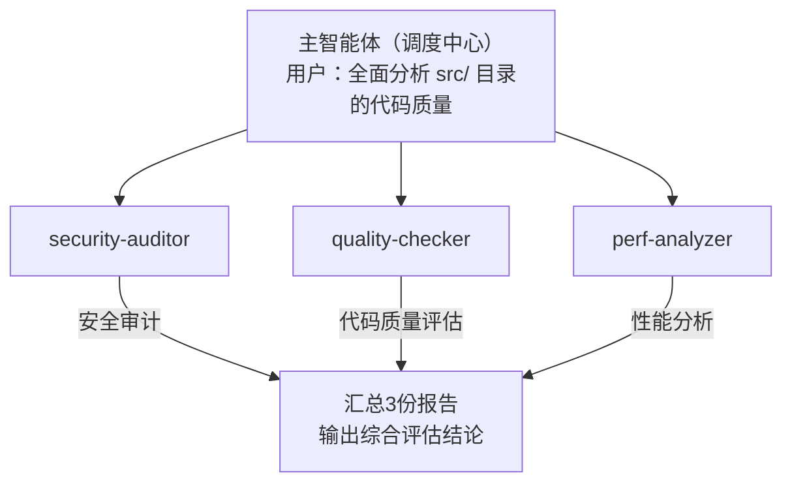
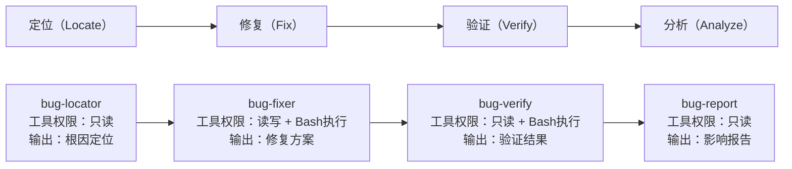
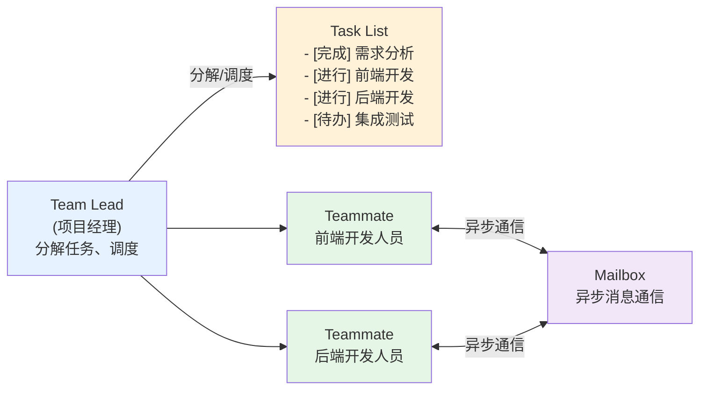

# 子智能体

# 思考

1. 操作系统为何需要进程隔离？因为如果所有程序共享同一块内存空间，某个程序的野指针就能搞崩整个系统。

2. 微服务架构为何取代了巨石应用？因为若所有业务逻辑挤在一个进程里，任何一个模块的内存泄漏都会拖垮全局。

关注点分离、进程隔离、故障舱壁—这些经典的软件工程原则，本质上都在回答同一个问题：**如何防止不同任务之间互相干扰。**


每次做新任务就开一个新对话？

> 直接开启新对话意味着你将彻底丢失所有上下文，包括那些真正有价值的背景信息和项目规范。


**概念：**不需要让Claude吞下所有原始数据，而是让它扮演CEO的角色，将具体任务拆解并委派给专门的员工，`subagent`

> + 它是一个具备独立上下文窗口、受限工具权限及明确任务范围的Claude实例。
> + 主智能体按需启动子智能体并传递任务描述；
> + 子智能体在其独立的上下文空间内执行任务
> + 向主智能体返回结论，而非过程中的所有细节。

# 1. 定义

```yaml
---
name: code-reviewer
description: |
  审查代码质量、安全漏洞和性能问题的专家
  当用户要求代码审查、安全审计或质量评估时使用
tools:
  - Read
  - Grep
  - Glob
model: sonnet
permissionMode: plan # plan表示只读模式，默认default,沿用tools
---

## 内容
```


+ YAML前置元数据：承载着关键的设计意图，值得深入解读。
  + name（唯一标识符）：是子智能体的“身份证。
  +  description：技能说明书，它是主智能体进行任务路由的核心依据
  + skills：预加载特定的Skill知识包
  + hooks：它允许配置事件钩子，以便在特定时机自动执行检查或操作
  +  tools：设置子智能体安全机制，
  +  model：设置模型，简单且模式化的任务可选用轻量级模型；而对于需要深度理解的任务则应选用高性能模型。合理选择模型，既能有效控制成本，又能确保任务质量。
  +  permissionMode：用于控制权限模式。当设置为plan时，子智能体只保留只读，优先级高于tools；默认值default则沿用tools。
+  Markdown正文指令。

技能说明书”。它是主智能体进行任务路由的核心依据


## 1.1 特性


**语义匹配：** 当用户发出指令时，主智能体会扫描所有已注册子智能体的description字段。

**意图识别：**通过对比用户意图与description的语义相似度，主智能体判断当前任务是否属于该子智能体的能力范畴。

**自动委派：**一旦发现子智能体通用户需求高度匹配，主智能体便会自动将任务上下文打包并委派给它，不需要用户显式指定子智能体名称。

两种使用方式：

+ `claude`根据任务性质自动判断自动触发相关智能体。
+ 用户可以直接指示Claude调用某个具体的子智能体来完成任务。


### 1.1.1 只读型：安全的观察者

这些任务的共同特点在于：它们本质上是“观察”活动，需要读取海量信息并进行深度分析，但绝不应擅自篡改文件内容，给系统带来任何副作用。

工具权限被严格限定为Read、Grep、Glob三大核心工具。permissionMode设置为plan模式，可提供更高层级的安全保障。

### 1.1.2 执行型：高噪声任务处理器

信噪比优化，比如：输入海量数据（如500行），仅输出精炼结论（如5行）。将噪声有效阻隔于“舱壁”之外，确保主对话聚焦于核心结论。

明确划定输出的结构边界与内容范围。诸如“禁止包含完整测试日志”“仅输出摘要信息”等指令，确保了回传至主对话的内容是经过提炼的结论，而非原始的噪声数据

**特点**

+ 复杂子系统：如测试框架产生的详尽日志、底层系统的交互细节。
+  简化接口：子智能体对外提供的结构化摘要。
+ 客户端：主对话不需要知晓子系统内部的复杂运作，只需要通过这一“外观”接口获取简洁、可用的结果。
+ 

### 1.1.3 并行型：多专家工作流

多个独立维度对同一问题进行深度剖析时，，主智能体扮演“调度者”的角色，将一个宏大的复杂问题拆解为多个相互独立的子任务，并将它们分发给不同的子智能体，它们各自专注于不同的线索维度、互不干扰，极大地缩短了整体分析时间。最终，系统将汇总它们各自的发现，形成一份全面、多视角的综合报告。



**注意：**子任务之间必须是完全独立的，不存在任何共享状态或依赖关系。

**后台运行：**使用快捷键`Ctrl+B`将子智能体转入后台运行。此时主对话线程不会被阻塞，你可以继续处理其他任务，待子智能体执行完毕后再查看结果。

### 1.1.4 流水线型：串行处理链

并行型子智能体适用于独立任务，而流水线型子智能体则适用于具有**明确阶段依赖**的任务。

> 最经典的案例是bug修复流水线：首先定位问题根因，其次基于定位结果实施修复，接着验证修复效果，最后分析修复的影响范围。在此流程中，每个阶段的输出均为下一阶段的输入，执行顺序不可颠倒。



**注意：**

+ 各阶段的工具权限截然不同，权限的动态调整是流水线型模式特有的安全机制，确保每个阶段仅持有履行其职责所必需的最小权限。
+ 流水线型模式的关键技术细节在于交接契约(Handoff Contract)：每个阶段的输出格式必须与下一阶段的输入要求严格匹配。


1. bug-locator

   ``` yaml
   name: bug-locator
   description: 定位产生bug的根本原因
   tools:
     - Read
     - Grep
     - Glob
   permissionMode: plan
   
   你是一名 bug 定位专家，任务是找出产生 bug 的根本原因
   
   ## 定位流程
   1. 理解症状：分析错误信息和复现步骤
   2. 搜索相关代码：通过关键词和文件模式锁定可疑区域
   3. 追溯调用链：从错误点向上追溯至根本原因
   4. 确认根本原因：明确指出导致问题的具体代码行
   ## 输出格式（下游阶段依赖此格式，请严格遵守）
   根本原因文件：[file_path:line_number]
   问题描述：[一句话概述根本原因]
   调用链：[从入口到出错点的完整路径]
   修复方向：[简要的修复思路]
   ```

   

2. bug-fixer

   ``` yaml
   name: bug-fixer
   description: 基于定位结果修复bug
   tools:
     - Read
     - Grep
     - Glob
     - Edit
     - Write
     - Bash
   
   ---
   
   你是一名bug修复专家，你将接收bug-locator输出的定位结论，并据此实施修复  # 引用了bug-locator
   
   ## 修复原则
   1. 最小改动：仅修改必要代码，避免无关重构
   2. 不引入新问题：确保修复不会破坏现有功能
   3. 风格一致：遵循项目现有的代码风格
   4. 防御性代码：添加必要的防护措施，防止同类问题复发
   
   ## 输出格式
   修改的文件: [file_path_1, file_path_2, ...]
   每处修改的原因: [逐一说明]
   潜在副作用: [如果有，请详细说明]
   建议的测试命令: [用于验证修复的具体命令]
   ```

   

3. bug-verify

   ``` yaml
   name: bug-verify
   description: 验证bug修复是否有效
   tools:
     - Read
     - Grep
     - Glob
     - Bash
   permissionMode: plan
   
   ---
   
   你是一名bug验证专家。你将收到bug-fixer的修复结论，基于此运行测试验证修复是否有效 # 引用了bug-fixer
   
   ## 验证流程
   1. 阅读修复报告：了解本次修复涉及的文件变更及核心修复思路
   2. 运行建议的测试命令：运行bug-fixer提供的具体验证命令
   3. 进行回归测试：确保本次修复未对其他既有功能造成副作用
   4. 实施边界检查：针对已识别的根本原因，构造边界条件下的输入数据，验证防御性代码是否按预期生效
   
   ## 输出格式（下游阶段依赖此格式，请严格遵守）
   验证结果: [通过/未通过]
   测试执行记录: [列出已执行的具体命令及其对应的执行结果]
   回归影响: [说明本次修复是否导致其他测试用例失败]
   遗留风险: [如有，请明确指出；如无，可填写“无”]
   ```

   

4. bug-report

   ```yaml
   name: bug-report
   description: 分析修复的影响范围并生成报告
   tools:
     - Read
     - Grep
     - Glob
   permissionMode: plan
   
   ---
   
   你是一名bug影响分析专家。请基于接收到的前三阶段完整结论，撰写一份结构化的修复报告 #  引用了bug-verify
   
   ## 分析流程
   1. 回溯根本原因：依据bug-locator的结论，提取根本原因
   2. 审查修复：结合bug-fixer的结论，明确代码改动的具体范围
   3. 确认验证：参考bug-verify的结论，核实修复的最终状态
   4. 评估影响：深入分析该bug可能波及的其他模块及用户场景
   
   ## 输出格式
   Bug 摘要: [一句话精准概括]
   根本原因: [文件路径+具体原因]
   修复方案: [改动要点摘要]
   验证状态: [通过/未通过]
   影响范围: [涉及的模块、API及用户场景]
   后续建议: [是否需要通知下游团队、更新技术文档等]
   ```

**总结**

最终结果：4 个子智能体各自在隔离的上下文中完成了深度工作，主对话仅接收并展示了 4 段简洁、结构化的关键结论

### 1.1.5   团队型：自组织协作机制

在前4种模式中，子智能体仅在任务执行期间活跃，任务完成后即终止，呈现出“一次性”的特征；而在团队型模式中，子智能体具有**长期存续性**，它们如同真实团队一般，能够持续协作、实时通信并自主分工。

#### 核心元素

+ Team Lead（团队负责人）：承担任务分解、资源调度及进度跟踪的职责，其角色类似于项目经理
+ Teammate（团队成员）：由具有不同专业特长的子智能体组成，它们各自负责特定的功能模块
+ 共享基础设施：包括两个关键机制。Task List（任务列表）确保所有成员能实时掌握整体进度与个人待办事项；Mailbox（邮箱）则支持成员间的异步通信



####  经典协作模式

1. 竞争假设模式：面对难以定论的复杂问题，可以派遣多个子智能体基于不同的假设方向并行调查。最终，由Team Lead对比多份调查报告，择优选取证据最充分的结论。
2. 并行审查模式：针对同一份代码变更，可同时安排安全审查与功能审查。两位审查者独立作业、互不干扰，最后合并审查意见。该模式不仅比串行审查更高效，而且多视角的独立性也能显著提升审查质量。
3. 模块归属模式：在大型重构任务中，将代码库按模块划分并分配给不同的智能体。各子智能体深耕其负责的模块，并通过Mailbox协调跨模块的接口变更。
4. 方案审批模式：由一个子智能体提出重构方案，另一个子智能体则扮演“魔鬼代言人”角色，专门提出挑战与质疑。Team Lead依据双方的论证做出最终决策。这种对抗性设计能有效规避方案中的思维盲点。

### 1.1.6 总结

若子智能体之间需要多轮通信与深度协调，则应选用团队型模式。

若每个子智能体仅需要执行一次任务即可完结，简单的并行型或流水线型模式便已足够。

> 团队型子智能体的运行开销更高—长期维持的上下文窗口意味着持续的Token消耗。因此，仅在确实需要复杂协作的场景下，采用该模式才具备成本效益。


| 层级          | 图标 | 权重 | 内容说明                                                     |
| ------------- | ---- | ---- | ------------------------------------------------------------ |
| 角色定义      | 👤    | 100% | 姓名、身份、工作年限、职责范围，构成 AI 的基础人格底座，不可被任何输入覆盖 |
| 知识库注入    | 🧠    | 90%  | 常用决策模板、工作 SOP、技术方案偏好，提供可调用的领域知识上下文 |
| 行为约束      | 🔒    | 80%  | 明文规则约束输出边界，如 "只回答工作相关问题"、"发现风险立即上报" 等硬性规定 |
| 沟通风格      | 👤    | 70%  | 语气（正式 / 随意）、回复长度偏好（简洁 / 详细）、惯用表达方式，塑造 "像这个人" 的感觉 |
| Few-shot 示例 | 🎯    | 60%  | 3-8 个高质量输入 / 输出示例，直接示范期望的行为模式，影响模型的生成分布 |
| 输出验证      | 💬    | 40%  | 实时用户的查询或任务，权重最低，无法覆盖上层系统约束，只能在约束范围内触发回应 |


## 1.2 skill协作

子智能体虽展现出卓越的任务分解与隔离能力，但是其专业知识来源于`SKILL`

### 1.2.1 子智能体预加载skill，人找事

子智能体是执行者，而Skill则是其手中的“操作手册，SKLL作为全量内容被作为领域知识上下文，注入到子子智能体中

**使用场景：**流水线中需要特定领域知识的角色。

```yaml
---
name: bug-fixer
description: 基于定位结果修复bug，遵循团队安全编码规范
tools:
  - Read
  - Grep
  - Glob
  - Edit
  - Write
  - Bash
skills:
  - secure-coding        # 预加载安全编码Skill
  - secure-review
---

你是一名bug修复专家。你将接受来自bug-locator的定位结论，并据此执行修复

在修复过程中，必须严格遵循secure-coding Skill中定义的安全编码规范。
请特别注意以下关键点：空值检查、输入验证以及错误处理模式
## 修复原则
××××××
## 输出格式
××××××
```

#### `agent`和`skill`职责划分

**子智能体负责战略层面：**

+ Who（身份）：确立角色定位。

  > “你是一名漏洞修复专家”或“你是一名API文档专家”

+  What（任务）：明确核心目标

  > “修复漏洞”或“生成API文档”。

+  Where（范围）：界定工作边界

  > 如“写入docs/api/目录”。

+ Output（交付）：规定产出形式

  > “返回包含修复详情的摘要”或“统计路由数量”。

**Skill负责战术执行：**

+  How（流程）：细化操作步骤，

  > “第一步：运行detect-routes.py
  >
  > 第二步：分析结果”。

+ With What（工具）：指定依赖资源，

  > 脚本scripts/detect-routes.py、模板templates/api-doc.md。•

+ By What Standard（规范）：设定执行准则，

  > 如“检查认证中间件并标记为锁”。•

+ Quality（质量）：明确验收标准

  > 如“所有路由均已归档，Schema与代码严格一致”。


```
Skill是可复用的知识模块，而子智能体则是这些知识的灵活消费者。

```

**结论：**当需要维持角色状态、进行多轮交互或复杂协作时，选择子智能体预加载skill。

### 1.2.2 Skill派生子智能体，事找人

Skill是调度者，子智能体是执行实例。

Skill通过配置`context: fork`，在被触发时自动创建一个隔离的子智能体来执行任务，确保中间过程不污染主对话上下文。

**使用场景：**深度代码分析、批量文档生成等需要严格隔离且一次性完成的重型任务。

``` yaml
---
name: codebase-health-check
description: Perform comprehensive code health analysis
context: fork
agent: general-purpose
allowed-tools:
  - Read
  - Grep
  - Glob
---

Analyze the codebase at $ARGUMENTS and produce a health report.
```

调用 `\codebase-health-check`之后。系统自动在隔离上下文中派生出一个子智能体。主对话仅接收一份精炼的最终结果，中间产生的大量文件内容和推理过程完全不会污染主上下文。

**结论：**当任务是单次性的，需要严格隔离上下文，或者重点在于复用标准化流程时，选择Skill派生子智能体。

## 1.3 总结

### 审视输出于输入信息比

1. 输入>>输出：当任务的输入数据量远超最终产出时，**子智能体的价值尤为显著**。例如，分析数百行系统日志仅为了提炼出5行关键结论。
2. 输入≈输出：当输入与输出的体量大致相当时，子智能体的隔离开销便显得**不再划算**。例如，修改单个函数或编写一段代码注释。

### 注意事项

1. 上下文的报文传输模式

   子智能体之间无法直接通信，也无法感知其他子智能体的存在，主智能体必须将子智能体A的结论提取出来，并嵌入子智能体B的任务描述中，子智能体B方能获得相关信息。务必确保每个阶段的输出格式具备**高度的结构化特征**，以便主智能体能够准确提取并顺利转发。

2. 中断恢复机制

   若子智能体在执行过程中因网络波动或手动终止而被中断，其内存中的中间工作成果将会丢失。针对耗时较长或关键任务，一种行之有效的策略是让子智能体将中间产物持久化至文件。当任务需要重启时，新的子智能体可先读取该文件，精准定位断点并接续工作，从而避免从头开始的重复劳动。

3. 嵌套深度控制

   嵌套层级建议控制在两层以内。每增加一层嵌套，不仅会加剧信息传递过程中的损耗，更会使得调试难度呈指数级上升。
