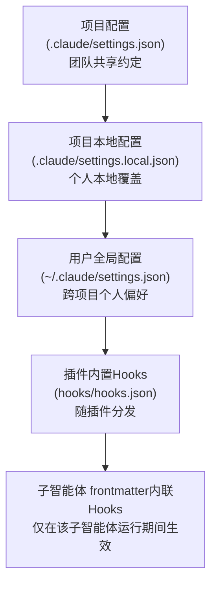
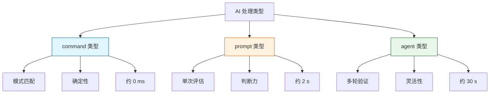

# Hook

它不作用于Claude的认知层，而是直接在系统执行层拦截其行为。策略(Policy)与机制(Mechanism)的分离。CLAUDE.md和Skills定义的是策略，即“应该怎么做”；而Hooks提供的是机制，即“一旦违反策略，将被物理阻止”。

Hooks对Claude的约束也不再依赖于Prompt的“引导”，而是通过系统底层的强制力来保障执行。

# 1. 事件生命周期：17个事件

+ 会话级事件
+ 工具调用事件
+ 子智能体事件
+ 完成事件
+ 较新的事件类型

## 1.1 会话级事件，3个

### 1. SessionStart 会话启动或恢复时触发

通过`CLAUDE_ENV_FILE`注入环境变量。Hook脚本可向该文件写入export语句，使变量在后续所有Bash命令中生效

> `CLAUDE_ENV_FILE`是Claude Code 内置环境变量，指向一个临时 shell 环境文件；所有 Bash 工具执行前会自动`source`该文件，里面定义的环境变量全局生效于会话内所有命令行操作。

```bash
#!/bin/bash
# session-init.sh — SessionStart Hook
if [ -n "$CLAUDE_ENV_FILE" ]; then //判断变量存在时，追加两行环境变量导出语句到临时环境文件
    echo 'export NODE_ENV=development' >> "$CLAUDE_ENV_FILE" 
    echo 'export DEBUG_LOG=true' >> "$CLAUDE_ENV_FILE"
fi
exit 0 //exit 0正常退出无阻塞
```

### 2. SessionEnd 会话终止时触发

可区分不同的终止原因，常用于清理临时资源或记录会话统计信息：

+ clear（用户清除）
+ logout（登出）
+ prompt_input_exit（用户退出输入）


### 3. PreCompact 上下文压缩前触发

适合在压缩前备份完整的对话记录

+ 用户主动执行`/compact`
+ `auto`（上下文窗口满后自动压缩）

## 1.2 工具调用事件，5个

涵盖了Claude每次工具调用的完整生命周期

### 1.  PreToolUse（整个Hooks系统中最强大的事件）

工具实际执行之前触发。它支持3种操作：

+ 允许（allow，绕过权限检查直接执行）
+ 拒绝（deny，阻止执行并说明原因）
+ 修改（updatedInput，调整输入参数后执行）。
  + 它允许你在不中断操作的前提下，静默地为命令添加安全参数。

```bash
{
  "hookSpecificOutput": {
    "hookEventName": "PreToolUse",
    "permissionDecision": "allow", //允许本次工具调用，不阻断命令执行
    "updatedInput": {  //钩子改写后的工具入参
      //Hook 脚本识别出是 rm 删除操作，自动补全 --dry-run 保护参数,仅打印将要删除的文件列表，不做实际删除操作。
      //既让Claude继续完成任务，又避免了文件被真正删除的风险。
      "command": "rm -rf /tmp/test --dry-run"
    }
  }
}
```

###  2. PostToolUse

在工具成功执行后触发。虽然它无法撤销已发生的操作，但具一下核心功能：

+ 通过additionalContext向Claude反馈额外信息（如代码Lint检查结果）；
+ 对输出进行后处理（如自动格式化刚写入的文件）。
+ 针对MCP场景，该事件还拥有专属能力：可通过updatedMCPToolOutput字段直接替换MCP工具的原始输出内容。

### 3. PostToolUseFailure

在工具执行失败后触发，主要用于错误告警以及提供纠正性反馈。

## 4. PermissionRequest 

在权限对话框即将弹出时触发。仅在Claude需要用户手动确认权限时才被激活。通过该事件，你可以以编程方式自动批准或拒绝权限请求。

```yaml
{
  "hookSpecificOutput": {
    "hookEventName": "PermissionRequest",
    "decision": {
      //自动放行，无需弹窗询问用户；可选值还有 deny（直接拒绝）、prompt（弹出窗口让人工确认
      "behavior": "allow", 
      //无修改权限范围，沿用本次操作原本申请的权限集合，没有新增 / 删减权限。
      "updatedPermissions": {}
    }
  }
}
```


### 5. UserPromptSubmit

在用户提交输入后、Claude开始处理之前触发。

> 例如，在用户每次发送消息时，自动附加当前的Git分支信息


## 1.3 子智能体事件 2个

### 1. SubagentStart 

在子智能体启动时触发，其匹配器可根据子智能体的类型名称进行筛选，既支持内置类型（如Bash、Explore、Plan）也支持自定义类型

> 虽然SubagentStart无法阻止子智能体的启动，但运行时会通过additionalContext注入关键上下文信息，例如，每当启动code-reviewer时，自动加载团队的编码规范。

### 2. SubagentStop

在子智能体完成任务后触发，既可以放行停止操作，也可以拦截该请求，强制子智能体继续工作直至满足特定的质量标准。此外，SubagentStop的输入数据包含两个关键路径

+ transcript_path（主会话记录）
+ agent_transcript_path（子智能体自身的对话记录）。

借助这些信息，Hook脚本能够复盘子智能体的完整工作流程，从而对其产出质量进行精准评估。


**放行停止操作**：认可当前子代理的输出质量，同意它结束运行、销毁隔离子会话，将现有结果返回主对话，不再追加任务、不再重新执行子代理。

```yaml
{
  "hookSpecificOutput": {
    "hookEventName": "SubagentStop",
    "decision": {
      "behavior": "allow" // 校验通过  "block"：表示校验失败，不允许停止
      //"additionalPrompt": "报告缺少依赖漏洞扫描、单元测试覆盖率统计，请重新完整分析代码库"
    }
  }
}
```


## 1.4 完成事件 2个

### 1. Stop

完成整轮响应时触发，这是实现“质量门控”机制的核心。

> 如果检测到输出内容未满足预设标准（如代码规范、安全策略等），可以通过设置decision:''block''阻止会话结束，强制Claude继续修正或完善工作，直至符合要求。

### 2. Notification

在Claude发送系统通知时触发。

其匹配器能够精准区分不同类型的通知，如：

+ permission_prompt（权限请求）
+ idle_prompt（空闲提示）
+ auth_success（认证成功）等。

>该事件常用于自定义通知渠道的集成，例如，将关键警报转发至Slack或钉钉，或在本地触发桌面弹窗提醒。

## 1.5 较新的事件类型 5个

### 1. TeammateIdle

任意一个团队内的子队友智能体，完成分配给自己的子任务、无剩余待执行指令，系统判定该代理即将进入**空闲休眠状态**的瞬间触发。

1. **分配新任务**

   钩子返回指令阻止代理进入休眠，从全局任务池派发剩余工作给当前空闲队友，最大化并行算力。

   > 代码审计团队，一个队友读完文件空闲后，钩子直接分配另一批目录检索任务，不用新建子代理。

2. **主动回收 / 挂起资源**

   确认当前无剩余任务，放行空闲操作，允许代理休眠、释放上下文内存，节省会话 token 与资源开销。


3. **状态上报**

   记录队友空闲时长、任务完成量，输出团队负载监控日志。

### 2. TaskCompleted

**触发标准：**

+ 单个队友完成**分配给它的全部子任务**，标记自身子任务完成。
+ 整个团队所有代理全部完工，顶层总任务被标记为完整结束。

**核心作用**

1. **质量拦截校验**

   即使代理标记任务完成，钩子检查产出结果是否达标（报告缺失、漏洞遗漏、代码分析不全），判定不合格则撤销 “完成标记”，打回重跑。

2. **多代理结果聚合**

   收集所有队友的输出，合并成统一汇总报告，补充交叉验证逻辑（A 代理扫描漏洞、B 代理校验依赖，钩子合并两份结果做对比）。

3. **后置收尾动作**

   任务确认合格后，自动执行清理、归档、导出报告、环境重置等收尾流程。

4. **分支任务联动**

   某个子任务完成后，自动触发依赖它的后置任务分配给其他队友

### 3. ConfigChange

在配置文件发生变更时触发。该事件主要用于审计与合规，帮助开发者追踪设置变化历史，防止未经授权的配置修改。

### 4. WorktreeCreate

用户可以自定义版本控制工作流的初始化设置（如自动安装依赖）

### 5. WorktreeRemove

清理逻辑（如删除临时构建产物）。

## 1.6 总结

在全部17个事件中，“能否阻止”是最核心的分类维度，它决定了事件是用于“控制流程”还是仅用于“观察记录”。

**具备阻止能力：**`PreToolUse`、`PermissionRequest`、`UserPromptSubmit`、`Stop`、`SubagentStop`、`TeammateIdle`、`TaskCompleted`、`ConfigChange`、`WorktreeCreate`。

**侧边效应**：`SessionStart`、`PostToolUse`、`PreCompact`、`SessionEnd`、`Notification`、`SubagentStar`、`WorktreeRemove`、`PostToolUseFailure`属于只读模式。它们主要用于读取上下文。注入额外的信息或触发侧边效应（如发送通知），但无法直接阻止或修改Claude的核心执行逻辑。


优先精通`PreToolUse`（工具执行前的“守门员”）、`PostToolUse`（工具执行后的“质量守卫”）、`Stop`（任务完成时的“质量门控”），即可构建出健壮的自动化闭环。

## 2 配置体系



**配置结构：**事件类型→matcher组→Hook处理器列表

### matcher

matcher字段用于指定该组Hook适用的工具范围。

+ 常用系统工具。

  + `Bash`、`Read`、`Write`、`Edit`、`MultiEdit`、`Glob`、`Grep`、`WebFetch`、`WebSearch`、`Git`

+ SubAgent （支持正则）

  + `matcher": “code-reviewer” `,` matcher": “code-.*” `、` matcher": “agentName01|agentName02” `

+ MCP 外部工具（固定前缀 `mcp_`，支持正则）

  + `mcp_服务名_工具名`、`mcp_xxx_.*`

    如："matcher": “mcp\_filesystem\_write_file” ， matcher": “mcp\_filesystem\_.*” 

+ *：匹配所有工具。

**注意：**不支持`skill`和`command`

> 多工具用 `|` 分隔，如：`"Write|Edit"`

```
对于Stop、Notification、UserPromptSubmit等生命周期事件，matcher字段将被忽略，因为这些事件不针对特定工具。
在SubagentStart或SubagentStop事件中，matcher匹配的是子智能体类型名称，而非工具名称。
```


```yaml
{
  "hooks": {
    "PreToolUse": [
      {
        "matcher": "Bash",
        "hooks": [
          {
            "type": "command",
            "command": "./.claude/hooks/block-dangerous.sh",
            "timeout": 30
          }
        ]
      }
    ],
    "PostToolUse": [
      {
        "matcher": "Write|Edit",
        "hooks": [
          {
            "type": "command",
            "command": "prettier --write \"$CLAUDE_FILE_PATH\""
          }
        ]
      }
    ]
  }
}
```


### 处理器

Hook处理器包含3种类型，构成了一个“确定性递减、灵活性递增”的阶梯。具体选择取决于验证逻辑所需的判断力度。

+ command类型：确定性规则
+ prompt类型：单次大模型评估
+ agent类型：多轮子智能体验证

#### command

该类型用于执行Shell命令或脚本。作为最常用且最可靠的类型，确定性规则永远比大模型的判断更为可信

```json
{
  "type": "command",
  "command": "./.claude/hooks/check-security.sh",
  "timeout": 30
}
```

command类型的Hook通过stdin接收JSON格式的上下文数据（包含session_id、tool_name、tool_input等），通过stdout输出JSON格式的决策，并依据退出码表达最终意图。

+ 退出码0：表示成功。系统将stdout中的JSON解析结果作为决策依据。

+  退出码2：表示有意阻止操作。系统将stderr的内容作为错误原因反馈给Claude。

+ 其他退出码：表示脚本异常，但往往不会阻止操作。stderr内容仅在调试模式下可见，但不会阻断主流程。

  > 脚本自身故障不应阻碍正常工作流—这正如烟雾报警器自身发生故障时，不应因此禁止人员进出大楼。


#### prompt类型

当验证逻辑需要理解、推理、判断等一定的判断力，但不需要执行多步操作，单次大模型判断就能出结果时，建议使用prompt类型。该类型会调用小型的模型（通常为Haiku）对当前情况进行评估。

```
{
  "type": "prompt",
  //
  "prompt": "评估这段代码修改是否引入了安全漏洞。$ARGUMENTS", //运行时自动替换成Hook 捕获到的完整输入 JSON
  "model": "claude-haiku-4-5",
  "timeout": 30 //30 秒内模型没返回结果则判定校验失败
}
```

$ARGUMENTS为占位符，运行时会自动读取当前 Hook 触发时的全部上下文信息，不需要你手动拼接、提取字段。

解析返回：

```
{"ok": true, "reason": "××××××"}
或者
{"ok": false, "reason": "××××××"}
```


####  agent类型：多轮子智能体验证

当验证逻辑需要实际查看代码文件、执行搜索或多步操作才能得出结论时，应使用agent类型。该类型会启动一个子智能体，以便能够利用Read、Grep、Glob等工具进行多轮深度验证。

```
{
  "type": "agent",
  "prompt": "检查所有修改的文件是否通过了单元测试。运行测试套件并验证结果。$ARGUMENTS",
  "model": "claude-haiku-4-5",
  //"agentName":"unit-test-check-agent"
  "timeout": 120
}
```

面对agent类型hook，model或者agentName至少要指定其中一个


### 2.1 总结

**原则：**能用command类型的不用prompt类型，能用prompt类型的不用agent类型。

> command在速度和可靠性上永远优于大模型判断。只有当验证逻辑确实需要“理解力”或“检查代码能力”（多文件上下文检索）时，才考虑升级到prompt类型或agent类型。



## 3. hookSpecificOutput

 ```json
 {
   "type": "command",
   "hookEventName": "PreToolUse",
   "timeout": 5,
   //正则 / 字符串匹配规则，命中则拒绝执行
   "commandMatchRules": [
     {
       "cmdPattern": "^(sudo\\s+)?rm\\s+.*-[fr]+\\s+/(etc|usr|var)(/.*)?",
       "decision": "deny"
     },
     {
       "cmdPattern": "rm -rf /usr*",
       "decision": "deny"
     },
     {
       "cmdPattern": "rm -rf /var*",
       "decision": "deny"
     }
   ],
   //命中拦截规则后，固定输出你截图中的返回结构  
   "denyOutputTemplate": {
     "hookSpecificOutput": {
       "hookEventName": "PreToolUse",
       "permissionDecision": "deny",
       "permissionDecisionReason": "此命令试图删除受保护的系统目录",
       "additionalContext": "受保护的路径模式: /etc, /usr, /var"
     }
   },
   //会话控制指令
   "sessionControl": {
       "continue": false, //紧急终止claude的处理
       "stopReason": "检测到安全违规，会话已终止",
       "suppressOutput": false,
       "systemMessage": "警告：此操作已被安全策略拦截"  //该字段的内容将直接显示给用户，而不会传递给Claude
     }
 }
 ```

`permissionDecision`支持3种值：

+ allow：绕过权限系统直接执行。
+ deny：阻止执行。
+ ask：交由用户确认

`additionalContext`字段适用于所有事件类型，其内容将被注入Claude的上下文中。

`sessionControl`同样所有的事件都支持


### 3.1 安全防护

#### 1. 能引发灾难的Bash危险命令拦截

``` bash
#!/bin/bash
# .claude/hooks/block-dangerous.sh

# 任意命令报错（返回非 0 退出码）时，脚本立即终止，避免异常逻辑继续运行
set -e

INPUT=$(cat)

# 提取命令（调试信息输出至stderr）
# jq 解析 JSON，取出 tool_input.command 字段
COMMAND=$(echo "$INPUT" | jq -r '.tool_input.command // ""')
# 打印调试日志，输出到标准错误 stderr；
# >&2 作用：不干扰钩子需要输出给 Claude 的 JSON 结果，日志仅在编辑器输出窗口可见
echo "DEBUG: Checking command: $COMMAND" >&2

# 危险命令模式列表
DANGEROUS_PATTERNS=(
  "rm -rf /" # 全盘删除
  "rm -rf ~" # 强制删除当前用户家目录
  "rm -rf \$HOME" # 强制删除当前用户家目录
  "> /dev/sd" # 把命令的标准输出覆盖写入目标文件，会清空目标原有全部内容。
  "mkfs."  # mkfs 系列磁盘格式化命令，会清空分区全部数据
  ":(){ :|:& };"              # 无限递归创建进程
  "chmod -R 777 /" # 根目录所有文件全开读写执行权限
  "git push --force origin main" # 强制推送覆盖远程主分支
  "git push --force origin master" 
  "git reset --hard origin" # 清空本地所有未推送提交，本地代码直接丢失
  "DROP DATABASE"
  "DROP TABLE"
  "TRUNCATE"
  "curl.*| sh"   # 在线下载未知脚本盲运行，危险的管道执行
  "curl.*| bash" # 在线下载未知脚本盲运行，危险的管道执行
)

for pattern in "${DANGEROUS_PATTERNS[@]}"; do
  if [[ "$COMMAND" == *"$pattern"* ]]; then
    echo "BLOCKED: $pattern" >&2
    cat <<EOF
{
  "hookSpecificOutput": {
    "hookEventName": "PreToolUse",
    "permissionDecision": "deny",
    "permissionDecisionReason": "拦截危险命令模式: $pattern"
  }
}
EOF
    exit 2
  fi
done

echo '{"hookSpecificOutput":{"hookEventName":"PreToolUse","permissionDecision":"allow"}}'
exit 0
```


#### 2. PreToolUse：敏感文件保护

专注于保护敏感文件免受意外修改

```bash
#!/bin/bash
# .claude/hooks/protect-files.sh

# 遇到任意命令执行失败（返回非 0 退出码），脚本立刻终止，避免异常继续运行
set -e
#读取标准输入（Claude 传给钩子的完整 JSON 字符串），存入变量INPUT
INPUT=$(cat) 


# .tool_input.file_path：提取 JSON 里工具要操作的文件路径tool_input.file_path字段
# // ""：字段不存在或为空时默认返回空字符串，避免报错
# -r：raw 模式，输出纯文本，不带双引号
# $(命令)：bash命令替换，把命令输出赋值给变量
FILE_PATH=$(echo "$INPUT" | jq -r '.tool_input.file_path // ""')

# [ -z "$FILE_PATH" ]判断字符串长度是否为 0
if [ -z "$FILE_PATH" ]; then
  echo '{"hookSpecificOutput":{"hookEventName":"PreToolUse","permissionDecision":"allow"}}'
  exit 0
fi

# 从完整的文件路径中提取出文件名
FILENAME=$(basename "$FILE_PATH")

# 受保护的文件名模式
PROTECTED_FILES=(".env" ".env.local" ".env.production" "credentials.json"
  "secrets.yaml" "secrets.json" "id_rsa" "id_ed25519")

# 受保护的扩展名
PROTECTED_EXTENSIONS=("pem" "key" "p12" "pfx")

# 受保护的目录
PROTECTED_DIRS=(".git/" ".ssh/" "node_modules/")

# 检查目录
# ${数组[@]}：展开数组全部元素
for dir in "${PROTECTED_DIRS[@]}"; do
  # [[ ... ]]	Bash的高级测试结构，支持模式匹配
  # *"$dir"*  星号是通配符，表示任意字符
  if [[ "$FILE_PATH" == *"$dir"* ]]; then
    # 读取多行内容直到EOF标记，原样输出 JSON，无需手动拼接换行转义符
    cat <<EOF
{
  "hookSpecificOutput": {
    "hookEventName": "PreToolUse",
    "permissionDecision": "deny",
    "permissionDecisionReason": "不允许修改受保护目录中的文件: $dir"
  }
}
EOF
   # 自定义异常退出码，代表本次钩子主动拦截操作
    exit 2
  # 用于闭合if, 没有的话识别不到判断区块在哪里结束
  fi
# Bash 循环（for/while/until）的结束标记，代表循环体代码到此结束  
done

# 检查文件名
for name in "${PROTECTED_FILES[@]}"; do
  if [[ "$FILENAME" == "$name" ]]; then
    cat <<EOF
{
  "hookSpecificOutput": {
    "hookEventName": "PreToolUse",
    "permissionDecision": "deny",
    "permissionDecisionReason": "不允许修改敏感文件: $name"
  }
}
EOF
    exit 2
  fi
done
```


#### 3. 审计

```bash
#!/bin/bash
# .claude/hooks/audit-log.sh

INPUT=$(cat)
# 环境变量CLAUDE_PROJECT_DIR存在则用它，不存在就用当前目录 .
LOG_DIR="${CLAUDE_PROJECT_DIR:-.}/.claude/logs"
mkdir -p "$LOG_DIR"
LOG_FILE="$LOG_DIR/audit-$(date +%Y-%m-%d).log"

# 生成标准 ISO 精确时间戳，示例 2026-06-22T14:30:00.123+08:00
TIMESTAMP=$(date -Iseconds)
# 提取 JSON 里 tool_name（工具名：Read/Edit/Bash 等），取不到则默认 unknown，-r 输出纯文本
TOOL_NAME=$(echo "$INPUT" | jq -r '.tool_name // "unknown"')
# -c 压缩为单行 JSON；提取工具入参，不存在则为空对象 {}
TOOL_INPUT=$(echo "$INPUT" | jq -c '.tool_input // {}')

echo "[$TIMESTAMP] $TOOL_NAME: $TOOL_INPUT" >> "$LOG_FILE"
echo '{}'
exit 0
```

#### 4. 完整

3个独立的脚本整合进.claude/settings.json，就形成了一套严密的纵深防御体系。具体配置如下。

```json
{
  "hooks": {
    "PreToolUse": [
      {
        // matcher:匹配什么工具触发脚本
        "matcher": "Bash", 
        "hooks": [
          {
            "type": "command",
             // command：触发时执行哪个 shell 文件
            "command": "./.claude/hooks/block-dangerous.sh"
             
          }
        ]
      },
      {
        "matcher": "Write|Edit",
        "hooks": [
          {
            "type": "command",
            "command": "./.claude/hooks/protect-files.sh"
          }
        ]
      }
    ],
    "PostToolUse": [
      {
        "matcher": "*",
        "hooks": [
          {
            "type": "command",
            "command": "./.claude/hooks/audit-log.sh"
          }
        ]
      }
    ]
  }
}
```


在Hook触发时候：

1. Claude 内部收集本次 AI 即将调用工具的完整上下文；
2. 组装成一份固定结构 JSON；
3. 将这份完整 JSON 通过**标准输入 stdin** 传给你的 shell 脚本；

+ **tool_name：**工具类型 `Bash` / `Read` / `Write` / `Edit`
+ **tool_input：**当前工具专属入参对象
  + 文件类工具（Read/Write/Edit）：自带 `file_path`
  + Bash 工具：没有 `file_path`，取而代之是 `command` 字段

```json
{
  "hookEventName": "PreToolUse",
  "tool_name": "Edit",
  "tool_input": {
    "file_path": "src/repositories/user.ts",
    "content": "xxx修改后的代码",
    "start_line": 10
      
    //"command": "rm -rf test"
  }
}
```


### 3.2 代码质量自动化

#### 1. PostToolUse：自动格式化

每次Claude写入文件后，系统将自动触发格式化工具，Claude只需要专注于代码逻辑编写，格式化过程将在后台通过hook无感完成。

```bash
#!/bin/bash
# .claude/hooks/auto-format.sh

set -e

INPUT=$(cat)
FILE_PATH=$(echo "$INPUT" | jq -r '.tool_input.file_path // ""')

# FILE_PATH为空字符串或者路径不存在
if [ -z "$FILE_PATH" ] || [ ! -f "$FILE_PATH" ]; then
  echo '{}'
  exit 0
fi

# 获取后缀
EXTENSION="${FILE_PATH##*.}"

case "$EXTENSION" in
js|jsx|ts|tsx|json|md|css|scss|html)
  # command -v npx &> /dev/null：检测系统是否存在 npx 命令，不存在则跳过格式化；
  # prettier --write：原地覆盖文件，自动统一代码缩进、换行、引号；
  # 2>/dev/null：屏蔽工具报错日志，只保留脚本核心输出；
  if command -v npx &> /dev/null; then
    npx prettier --write "$FILE_PATH" 2>/dev/null
    echo '{"hookSpecificOutput":{"additionalContext":"已用 Prettier 格式化"}}'
  fi
  ;;
py)
  if command -v black &> /dev/null; then
    black "$FILE_PATH" 2>/dev/null
    echo '{"hookSpecificOutput":{"additionalContext":"已用 Black 格式化"}}'
  fi
  ;;
go)
  if command -v gofmt &> /dev/null; then
    gofmt -w "$FILE_PATH" 2>/dev/null
    echo '{"hookSpecificOutput":{"additionalContext":"已用 gofmt 格式化"}}'
  fi
  ;;
*)
  echo '{}'
  ;;
esac

exit 0
```

`command -v`进行环境检查。如果检测到格式化工具未安装，Hook将静默跳过而非抛出错误。这体现了“优雅降级”的设计原则：Hook自身的异常不应阻塞核心工作流的正常运行。


## 4. 异步Hooks：后台执行不阻塞

```json
{
  "type": "command",
  "command": "./.claude/hooks/run-tests-background.sh",
  "async": true,
  "timeout": 300
}
```

异步Hooks的两个关键限制决定了其适用边界：

+ 类型限制：仅command类型的Hook支持异步执行。
+ 拦截能力限制：异步Hooks无法阻止当前操作。

因此，异步Hooks适用于日志记录、异步通知、后台数据验证、非关键性质量审计等“事后处理”任务，不适用于需要实时阻断的安全检查（如SQL注入防御、敏感信息过滤）。


## 5. 环境变量与调试

**hook可用的环境变量**

| 环境变量            | 作用域          | 核心用途                                  |
| ------------------- | --------------- | ----------------------------------------- |
| CLAUDE_PROJECT_DIR  | 所有 Hook       | 获取当前项目的根目录绝对路径              |
| CLAUDE_SESSION_ID   | 所有 Hook       | 当前会话的唯一标识符                      |
| CLAUDE_TOOL_NAME    | 所有 Hook       | 触发当前 Hook 的工具名称                  |
| CLAUDE_FILE_PATH    | 所有 Hook       | 当前操作涉及的文件绝对路径（若适用）      |
| CLAUDE_ENV_FILE     | 仅 SessionStart | 环境变量持久化文件的路径                  |
| CLAUDE_NOTIFICATION | 仅 Notification | 包含具体的通知消息内容                    |
| CLAUDE_CODE_REMOTE  | 所有 Hook       | 布尔值标识，指示是否在远程 Web 环境中运行 |
| CLAUDE_PLUGIN_ROOT  | 仅 Plugin Hook  | 插件安装的根目录路径                      |

**CLAUDE_ENV_FILE**

1. 任意 Hook 里写入自定义变量，持久保存

   ``` bash
   # 示例：保存当前测试任务ID到持久环境
   echo "TEST_TASK_ID=task_67890" >> "$CLAUDE_ENV_FILE"
   # 覆盖写法（清空重写）
   echo "BUILD_MODE=dev" > "$CLAUDE_ENV_FILE"
   ```

2. SessionStart 读取持久化环境并载入脚本

   ```bash
   # SessionStart 钩子脚本内
   # 如果持久化环境文件存在，加载里面所有变量到当前会话
   if [ -f "$CLAUDE_ENV_FILE" ]; then
     # source 加载文件，变量全局生效给后续所有Hook/子代理
     source "$CLAUDE_ENV_FILE"
   fi
   ```

   

## 5.1 常见问题

直接编辑settings.json后，Hook往往不会立即生效。若需要生效，用户需要在/hooks菜单中确认变更，或重启当前会话。

