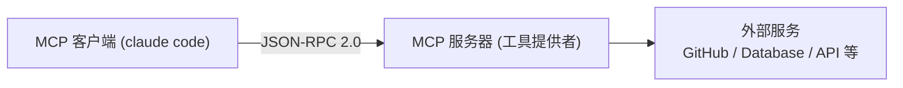

# AI集成领域的Type-C



# 1. 架构

**能力组成**

1. tool：供客户端主动调用的函数，定义了明确的名称、描述、输入参数架构(schema)及返回值格式。

2. Resources：指供Claude按需读取的数据

3. Prompts：是一类可复用的提示词片段，旨在使特定任务的启动方式标准化。

   > 功能与Skills存在一定重叠，且在实际应用中的普及度不及前两类，但它为任务初始化提供了便捷路径。

**传输方式**

+ **stdio：标准输入输出**

  专为本地进程通信设计的方式。客户端以子进程形式启动`MCP`服务器，并通过标准输入`stdin`和标准输出`stdout`传递消息。

  完全在本地运行，不需要网络连接，具备最高的安全性和最低的延迟，适用于文件系统访问、本地数据库连接及本地开发工具集成。

+ **HTTP：远程服务器通信的推荐传输方式**

  AI客户端向指定的HTTP端点发送POST请求，服务器处理完毕后返回响应。

> 本地选择stdio，远程选择HTTP

```bash
# 添加本地stdio服务器：启动一个本地文件系统服务，指定工作目录为/workspace
claude mcp add filesystem npx -y @modelcontextprotocol/server-filesystem /workspace

# 添加远程HTTP服务器：连接至公司内网的Jira服务
claude mcp add --transport http company-jira https://jira.company.com/mcp

# 添加用户级服务器（全局可用）：将GitHub服务添加到用户级别配置，使其对所有项目生效
claude mcp add --scope user github -- npx -y @modelcontextprotocol/server-github

# 添加带认证信息的服务器：通过自定义HTTP头传递认证Token
claude mcp add --transport http --header "Authorization: Bearer ${TOKEN}" api https://api.example.com/mcp

# 管理命令
claude mcp list            # 列出配置：查看当前所有已配置的 MCP 服务器
claude mcp test github     # 测试连接：验证指定服务器（如GitHub）的连接状态及可用性
claude --mcp-debug 		   # 启动mcp调试模式
claude mcp remove github   # 移除服务器：删除指定的 MCP 服务器配置
```


**环境变量替换**

基本语法${VAR_NAME}在运行时直接替换为对应的环境变量值，你可以将敏感数据保存在操作系统的环境变量或`.env`文件中，而不是硬编码在`.mcp.json`配置文件中。

```json
 "company-jira": {
      "type": "http",
      "url": "https://jira.company.com/mcp",
      "headers": {
        "Authorization": "Bearer ${JIRA_TOKEN}"
      }
    },
```

## 1.1 `Mcp+skills`：厨房与菜谱

**`MCP`如同专业厨房：**这里配备了所有必要的设备与原：冰箱（数据库）、炉灶（API调用）、食材（数据源）和刀具（工具）。厨师具备制作任何菜肴的能力，但具体“做什么”和“怎么做”，完全依赖厨师的临场发挥。

**`Skills`如同标准菜谱：**它提供了详尽的操作指南，明确规定了所需食材、操作步骤、火候控制及烹饪时长。有了菜谱，即使是经验尚浅的厨师也能稳定复现出高水准的菜肴。然而，若缺乏配套的厨房设备，再完美的菜谱也无法落地执行。

> 通过`MCP`获取实时数据能力，又能借助Skills数据处理方式。这意味着，Claude可实现稳定、高效的自动化执行。

在skill中可以通过`mcp_服务名_工具名`的方式直接调用MCP服务：

```
---
name: db-query
promptTriggers: ["查数据库", "postgres", "sql查询"]
---
你拥有Postgres数据库MCP工具，仅允许使用以下工具获取真实数据，禁止编造内容：
1. 获取全部表结构：`mcp__postgres__list_tables`
2. 执行SQL查询语句：`mcp__postgres__query`
查询前先调用list_tables确认表名与字段，再构造合法SQL执行。
```


>- **MCP 工具调用**是由 AI 助手在**运行时动态执行**的，**Skill 文件**只是给 AI 的**指令说明书**，告诉它在什么情况下该怎么做
>- 真正的 `mcp_服务名_工具名` 调用发生在 AI 的推理和执行过程中，而不是在 skill 文件里


## 1.2 常见问题

| 问题现象       | 可能原因                           | 解决方案                                                     |
| -------------- | ---------------------------------- | ------------------------------------------------------------ |
| 服务器无法启动 | 命令或路径配置错误                 | 检查配置文件中的 command 和 args 参数；尝试在终端手动运行该命令以验证是否可以正常启动 |
| 连接超时       | 网络不稳定或服务器响应过慢         | 设置环境变量 MCP_TIMEOUT（单位为毫秒），适当延长等待时间     |
| 认证失败       | Token 错误、缺失或已过期           | 确认相关环境变量（如 API_KEY 等）已正确设置；检查 Token 的有效性并及时刷新 |
| 输出被截断     | 返回数据量超过 Token 限制          | 调大环境变量 MAX_MCP_OUTPUT_TOKENS 的上限；优化查询逻辑（如增加 LIMIT），让服务器返回更精简的数据 |
| JSON 解析错误  | 服务器标准输出 (stdout) 被日志污染 | 确保服务器将调试日志、错误信息等非数据内容输出至标准错误 (stderr)，保持 stdout 仅包含纯净的 JSON 数据 |

MCP 协议规定：JSON-RPC 报文必须全部输出到stdout；所有打印日志、欢迎信息、调试输出必须重定向到stderr(>&2)，否则容易污染输出。

1. **stdout（标准输出，文件描述符 1）**：程序**正式返回数据**的通道
2. **stderr（标准错误，文件描述符 2）**：日志、调试、打印、报错、提示语专用通道

命令 `>&2` = 把这条打印重定向到 stderr，不污染 stdout。

