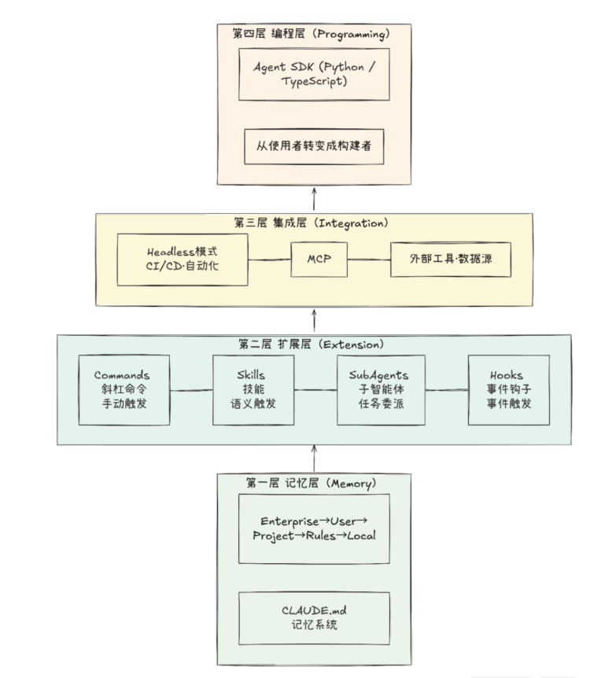
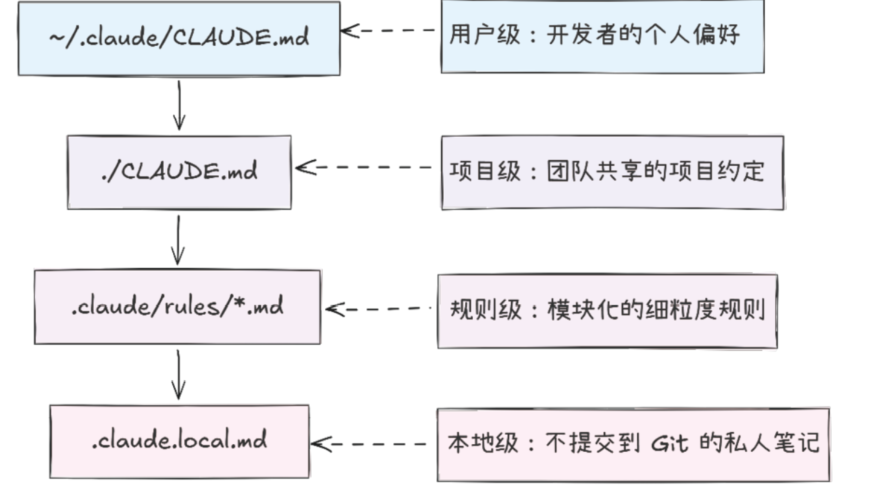
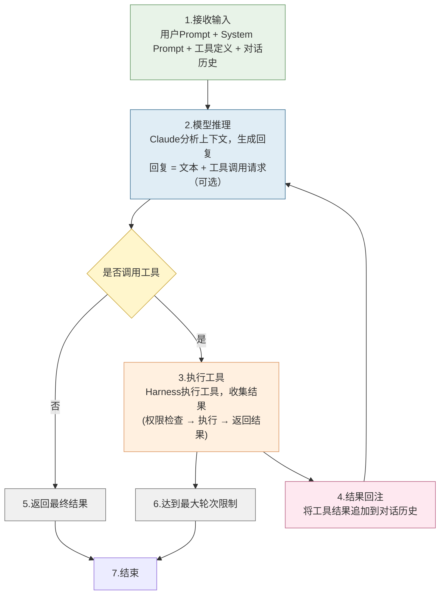
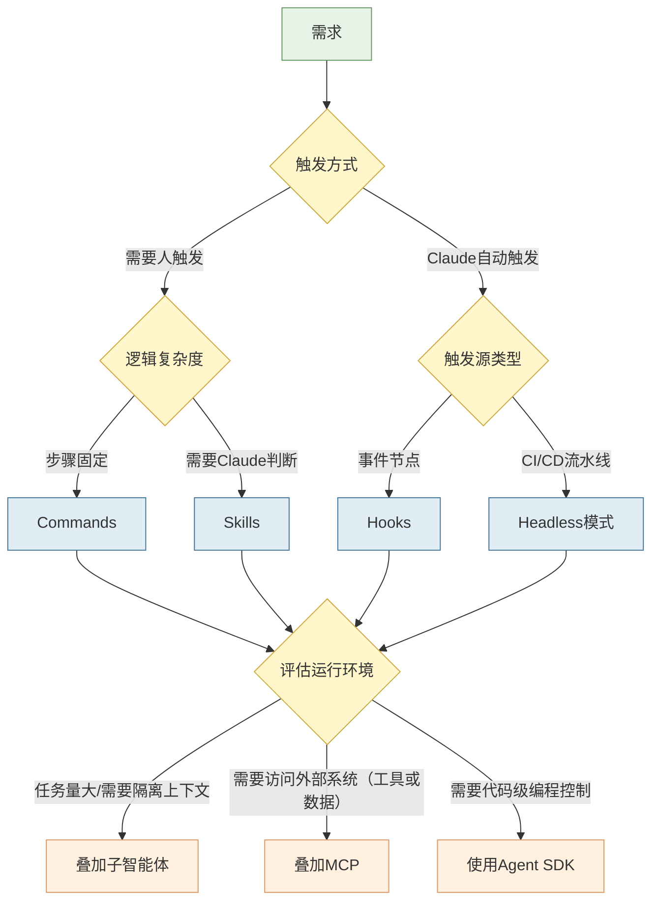

# Claude code 实战

很多人误把Claude当作简单的聊天工具，其实Claude本身是一个完备的可编程、可扩展、可组合的Agent框架，内置了记忆系统、skill、子智能体、Hooks及MCP等。我们遇到的每一个痛点，在框架层面都有对应的解决方案，只是我们尚未知晓。

# 1. Agent 框架


**`Claude.md`**：将项目规范、技术栈一次性写入配置文件，一劳永逸，不需要反复重申

**子智能体**：化解上下文溢出，实现并行处理和逻辑隔离

**`skill`**：终结风格飘忽，将行为标准配置化、制度化，彻底取代口头叮嘱的不确定性，实现自动加载

**Hooks**：在工具调用时候，自动触发安全检查或日志记录，构建防御性编程机制。将提交、检查配置为Hook，永不遗漏

**`MCP`**：打破数据孤岛，赋予Claude调用外部数据库与API的能力

**Headless模式**：支持在CI/CD流水线中，无人值守运行，实现真正的自动化交付

**`Agent SDK`**：允许通过代码编排复杂的多步Agent工作流，提升任务执行的灵活性

**`Plugins 生态`**：将能力打包封装，便于在团队内部高效分发与复用。

> 通过恰当的配置，将一切实现转化为自动化的流程


## 1.1 四层架构



1. **记忆层**：是地基，根基不稳，一切构建都将无从谈起，随时面临坍塌风险

2. **扩展层**：

   + Commands
   + Skills
   + SubAgents
   + Hooks

   共同构成了建筑的主体楼层，承载着日常运营的核心功能，这是 用户最直接感知的价值空间。

3. **集成层**：宛如隐藏起来却至关重要的水电管网，它将这 座建筑与外部广阔的基础设施网络紧密相连——通过连接广阔的基础设施，确保持续的能量与信息流动。

4. **编程层**：位于顶楼的建筑师工作室。你不仅仅是住户，而是拥有了设计全新建筑、重构空间逻辑的至高权力。

### 1.1 记忆层

Claude.md 本质是给AI的一份员工手册，每次对话启动时候，都能加载到Claude的上下文中



 这种分级设计与`CSS`的层叠优先级机制`全局—>用户—>项目—>本地`如出一辙，，每一级均可覆盖上一级的设定。

>这一看似简单的机制，实则是整个框架的基石。上层的Skills、 Commands、Hooks等所有配置与行为，均构建于Claude对项目上下文 的精准理解之上。恰如建筑地基虽不如外墙装饰般醒目，但若缺了它, 一切装饰都将无从依附。


## 1.2 扩展层

**`Command`**：将高频重复、步骤固定的操作，封装为用户手动一键触发的快捷方式。它将请求封装成对象，使客户端可以以参数化的方式处理不同请求。它一般存放在`.claude/commands`目录下。

**`Skill`**：可以不需要用户手动触发，Claude可以根据当前语义的上下文、skill的描述信息，自动研判并加载相应的skill。

> 这种隐藏触发机制，使得skill成为承载领域知识的理想载体。这种按需加载、闲时静默的机制，极大提升了交互的流畅度与智能性。


```yaml
---
name: code-reviewing
description: >
  Review code for best practices and potential issues.
  Use when the user asks for code review or mentions
  reviewing changes.
allowed-tools: // 允许使用工具
  - Read
  - Grep
  - Glob
---

# Code Review Guidelines
你是一个专业的代码审查员...
```

工具详细说明：[工具说明](tools.md)

**`SubAgents`**：旨在解决上下文窗口的有限性，子智能体的解决方案是为特定任务开辟独立的上下文空间，子任务完成任务之后，仅需将结论反馈给子任务，它一般存放在`.claude/agents`目录下，详细描述了智能体的角色定位、权限范围、行为准则。

```
Agent：我主动调用的工具人，按任务类型选
Skill：加载到上下文的行为指令，按触发条件和优先级加载
你实际使用中不需要操心这个选择逻辑，跟我说需求就行。如果我发现有歧义（比如多个 skill 都可能适用），我会问你确认。
```

```
当你在 Claude Code 中调用 Agent 工具（比如 code-reviewer 或其他子代理）时，它会在独立的上下文窗口中执行。具体机制是：

  1. 独立上下文：子代理启动时，我（主线）会写一个 prompt 发送给它。这个 prompt是自包含的，包含任务说明和必要的上下文（如文件路径、代码片段等），但它看不      到我这边完整的对话历史。
  2. 独立工具集：子代理可以自由调用文件读写、搜索、执行命令等工具，但它只能看到我告诉它的信息，以及它自己发现的内容。
  3. 汇总返回： 主线负责调度和决策，。子代理是执行单元，不是决策者。
```


**`Hooks`**：四大组件中唯一具备拦截能力的组件。

+ `PreToolUse`：工具调用前
+ `PostToolUse`：工具调用后
+ `Stop`：响应生成结束前

开发者可以在这些关键时期插入检查、拦截、增强逻辑。

>Commands：定义做什么
>
>Skill：指导怎么做
>
>Hooks：判断能不能做
>
>它们之间既可以单独使用，也可灵活组合以构建强大的工作流。
>
>每个组件专注解决一类特定问题，通过有机组合，激发出无所不能的系统效能


```json
{
  "hooks": {
    //定义了一个 PreToolUse 钩子： //当调用 Bash 工具时，
    "PreToolUse": [
      {
        "matcher": "Bash", //当调用 Bash 工具时
        "command": "python .claude/hooks/safety_check.py", //会阻塞式地先执行safety_check.py 脚本进行安全检查
        "blocking": true //只有脚本通过后才允许实际执行命令，用于防止危险命令的误执行
      }
    ]
  }
}
```

## 1.2 集成层

将Claude的核心能力延申至外部系统，使其真正融入开发生态。

### 1.2.1 Headless

可以使Claude在无人值守的环境中自动化运行，面向自动化流水线，将claude无缝嵌入既有的CI/CD体系


```sh
# 在 CI/CD 流水线中调用 Claude
claude -p "审查最近一次提交的代码变更，关注安全隐患和性能问题" \  #进入非交互模式直接传入提示词，无需用户键入，适合自动化场景
  --output-format json \   # 输出格式化为 JSON，便于下游 CI 工具（如 Jenkins、GitLab、CI）解析结果
  --max-turns 10 \ # 限制 AI 最大交互轮数为 10 步，防止流水线因任务超时而挂起 
  --allowed-tools Read,Grep,Glob #  限定仅使用只读工具
```

### 1.2.2 MCP

轻松扩展Claude的能力边界，将外部数据与服务引入Claude code的能力工具箱，是AI时代的 type-c


## 1.3 编辑层 Agent SDK

是设计新蓝图 的创造者。在记忆层、扩展层、集成层开发者主要通过配置文件和命令来延展Claude的行为边界，本质是使用者.

在编辑层开发者可以利用python或者typescript编写代码，直接调用Claude的底层核心能力，开始构建全新的AI agent

> 开发者代码触达之处，便是Claude能力延申之所。


```python	
import claude_code

# 用 SDK 构建一个代码健康度检查 Agent
result = claude_code.query(
    prompt="分析 src/ 目录下所有 Python 文件的代码质量，给出健康度评分",
    allowed_tools=["Read", "Grep", "Glob"],
    max_turns=15
)
print(result)
```


借助Agent SDK,你可以打造批量的代码审查工具、项目健康度仪表板、自动化测试报告生成器，甚至将多个Claude Agent 编排成一个高
效的协作团队。

Claude Code本身正式基于Agent sdk构建的AI agent，你在终端见的一切行为本质上都是Agent sdk层面的工具调用。它是一种框架模式的具体实现。

### 1.3.1  Harness 与 Agentic loop

**Harness：**Claude code只具备文本生成能力，没有harness，claude不过是空有大脑，寸步难行的大脑。

Harness围绕模型构建一切基础设施：

+ 工具系统
+ 控制权限
+ 上下文管理
+ 记忆系统
+ 事件钩子
+ 驱动上述运转的核心：Agentic loop

> 当你让Claude修复一个bug时候，它经历了：反复观察、假设验证直到模型自动停止或

#### harness 心脏




```
claude.md  专注于让Claude知道什么
Skill：专注于让怎么做
subagent：专注于让确定谁来做
Hooks:专注于能否做
```


### 1.3.2 Plugins 组合的打包与分发

`Plugins`：是一种标准化的打包方式，通过Plugin.json清单文件，将skill、commands、subAgent、mcp、hooks统一封装。打包完成之后，只需要一条安装命令，所有配置即可安装到位。

skill是**能力类型**，Plugins是**分发形式**。对于团队负责人来说Plugins是将最佳实践标准化，实现新人入职，一键配置到位的利器。


## 1.4 技术选型



