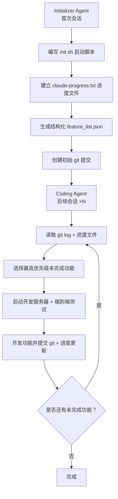

# Harness

 缰绳、马鞍：引导强大但不可预测的动物的完整装备。驾驭工程不是去削弱 AI 的能力，而是为它打造一套黄金缰绳，让它跑得不失控且又快又稳。

人类掌舵、智能体执行
```
模型正在逐渐吸收框架约 80% 的功能（智能体定义、消息路由、任务生命周期……），但剩余 20%—— 持久化、确定性重放、成本控制、可观测性、错误恢复 —— 正是驾驭层存在的价值。
```

> Agent 的每一次失败，都是环境设计不完善的信号。正确的回应不是换一个更强的模型，而是重新设计它运行的环境。


| 层级 | 名称             | 核心文件 / 模块                                           | 核心作用                                              | 类比                         |
| ---- | ---------------- | --------------------------------------------------------- | ----------------------------------------------------- | ---------------------------- |
| 1️⃣    | CLAUDE.md 入口层 | `CLAUDE.md`（8 条红线、技术栈声明、文件索引）             | AI 读取的第一个文件，定义项目基本信息与不可触碰的红线 | 项目的「宪法序言」           |
| 2️⃣    | Rules 规则层     | 工程结构.md、编码规范.md、开发流程规范.md                 | 约束 AI 的行为，确保编码、流程、架构不跑偏            | 交通法规 —— 不可违反         |
| 3️⃣    | Skills 技能层    | 需求分析、编码实现、专家评审、单元测试、CI 门禁、部署验证 | 引导 AI 按固定流水线工作，明确 “先做什么、后做什么”   | 导航系统 —— 规划路径         |
| 4️⃣    | Wiki 知识层      | 业务模型.md、接口协议.md、数据模型.md、领域术语.md        | 为 AI 提供项目上下文，确保业务理解和术语统一          | 项目百科全书                 |
| 5️⃣    | Changes 记录层   | `summary.md`、`db-migrations.sql`、`rollback.sql`         | 追踪每一次 AI 变更，实现可追溯、可回滚                | 行车记录仪 —— 可审计、可回溯 |


## 1.1 Agent 常见失败模式

#### 1.1.1 失败模式 1：试图一步到位（One-shotting）

Agent 倾向于在一个会话里把所有功能都做完。结果是上下文窗口耗尽，留下一堆没有文档的半成品代码，下一个会话启动时只能花大量时间猜测之前发生了什么。

#### 1.1.2 失败模式 2：过早宣布胜利

在项目后期，当部分功能已经完成后，Agent 会环顾四周，看到已有进展就直接宣布任务完成 —— 即使还有大量功能未实现。

#### 1.3 失败模式 3：过早标记功能完成

在没有明确提示的情况下，Agent 写完代码就标记为完成，却没有做端到端测试。单元测试或 curl 命令通过了不代表功能真正可用。


```
智能体还有一个危险特性：它非常擅长模式复制。代码库里有什么模式，它就忠实地复制并放大 —— 包括坏模式和架构漂移。这意味着不加约束的 Agent 会以惊人的速度积累技术债务。
```

#### 1.4 对应策略

| 问题                            | 初始化 Agent 的行为                                | 编码 Agent 的行为                                        |
| ------------------------------- | -------------------------------------------------- | -------------------------------------------------------- |
| 过早宣布项目完成                | 建立功能列表文件：基于输入规格建立结构化 JSON 文件 | 会话开始时读取功能列表，选择单个功能开始工作             |
| 环境中遗留 bug 或未文档化的进度 | 编写初始 git 仓库和进度记录文件                    | 开始时读取进度文件和 git 日志；结束时提交 git 和进度更新 |
| 过早标记功能为完成              | 建立功能列表文件                                   | 自我验证所有功能，仅在仔细测试后才标记为 "passing"       |
| 需要花时间弄清如何运行应用      | 编写可启动开发服务器的 init.sh 脚本                | 会话开始时读取 init.sh                                   |


####  1.5 AI工程范式三次跃迁

| 范式       | 核心问题              | 优化对象                  | 交互模式             | 类比                                         |
| ---------- | --------------------- | ------------------------- | -------------------- | -------------------------------------------- |
| 提示词工程 | 怎么把话说清楚        | Prompt 的措辞、格式、示例 | 一问一答             | 对马喊话的技巧                               |
| 上下文工程 | 怎么给 AI 喂信息      | 文档、代码片段、历史对话  | 信息注入 → 生成      | 给马看地图                                   |
| 驾驭工程   | 怎么让 Agent 可靠工作 | 约束、反馈回路、控制系统  | 人类掌舵，Agent 执行 | 给马造一条高速公路，配上护栏、限速牌和加油站 |

## 1.2 核心组件

| 层级         | 加载时机                    | 内容示例                           | 上下文占用 |
| ------------ | --------------------------- | ---------------------------------- | ---------- |
| 会话常驻     | 每次会话自动加载            | AGENTS.md/ CLAUDE.md，项目结构概览 | 最小       |
| 按需加载     | 特定子 Agent 或技能被调用时 | 专业化 Agent 的上下文、领域知识    | 中等       |
| 持久化知识库 | Agent 主动查询时            | 研究文档、规格说明、历史会话       | 按需       |

## 1.3 Agent专业化

专注于特定领域、拥有受限工具的 Agent 优于拥有全部权限的通用 Agent。

专业化不仅是组织性的——它本身就是上下文管理策略。每个专家因为携带更少的无关信息，所以运行在小空间内，具备更好的可控性。


## 1.4. 持久化记忆（Persistent Memory）

**核心原则**：进度持久化在文件系统上，而非上下文窗口中。每次新 Agent 会话从零开始，通过文件系统制品重建上下文。

1. **初始化 Agent**：首次会话使用专门的 prompt，要求模型建立初始环境 ——init.sh 脚本、claude-progress.txt 进度文件和初始 git 提交。
2. **编码 Agent**：后续每次会话要求模型在做出增量进展的同时，留下结构化更新。





**每个编码 Agent 的典型会话启动流程：**

1. 运行 pwd 查看工作目录
2. 读取 git log 和进度文件，了解最近的工作
3. 读取 feature list 文件，选择最高优先级的未完成功能
4. 启动开发服务器，运行基础端到端测试
5. 确认基本功能正常后，开始新功能开发

**关键发现**：使用 JSON 格式追踪 feature 状态比 Markdown 更有效，因为 Agent 不太可能不恰当地修改或覆盖结构化数据。


## 1.5 结构化执行（Structured Execution）

**核心原则**：将思考与执行分离。研究和规划在受控阶段进行，执行基于验证过的计划，验证通过自动化反馈（测试、Linter、CI）和人类审查完成。

所有团队都施加了刻意的执行序列：**理解 → 规划 → 执行 → 验证**。

**人工检查点的价值**：审查计划远比审查代码快。当规格正确时，实现自然可靠。当规格有误时，可以在 500 行代码生成之前及时纠正。


## 1.6 架构约束（Architecture Constraints）—— 缰绳

OpenAI 团队建立了严格的层级依赖模型：

```
Types → Config → Repo → Service → Runtime → UI
```

下层不能反向依赖上层。所有架构规则被编码为自定义 Linter 规则，违反即 CI 阻止合并 —— 无论代码是人写的还是 AI 写的。

有个关键细节：Linter 的错误信息本身也是上下文工程。它不只说你违反了规则 X，而是解释为什么这个规则存在、正确做法是什么，这样 Agent 读到错误后就能自我理解并修正，不需要人类介入。

------

##  1.7 反馈循环（Feedback Loop）—— 智能体审智能体

反馈循环中的钩子可以运行预定义的测试套件，并在失败时带着错误信息循环回到模型，或者提示模型独立评估其代码。

如果 AI 写的测试用例通过了带有 Bug 的代码，Harness 就会判定测试无效，强迫它重新思考测试边界。


##  1.8 熵管理（Entropy Management）—— 垃圾回收

随着时间推移，软件系统会逐渐混乱（熵增），技术债务会积累。OpenAI 采用持续小额偿还的策略，而不是等问题严重时集中处理 —— 他们把这个方法形象地称为**垃圾回收**，并认为技术债务就像高息贷款。


# 2. 实战

## 2.1 五大原则

**原则 1：设计环境，而非编写代码**

工程师的工作转向为 Agent 准备高效运行的环境。当 Agent 卡住时，不是 "更加努力"，而是诊断 "缺少什么能力" 并让 Agent 自己构建该能力。

**原则 2：机械化地执行架构约束**

为每个领域定义依赖方向：`Types → Config → Repo → Service → Runtime → UI`，并用自定义 Linter 和结构测试自动检测违规。文档中记录是不够的；如果不能机械化地强制执行，Agent 就会偏离。

**原则 3：将代码仓库作为唯一事实源**

写在 Slack 讨论或 Google Docs 中的知识对 Agent 来说等于不存在。所有团队知识都作为版本控制的制品放置在仓库中。

**原则 4：将可观测性连接到 Agent**

将 Chrome DevTools 连接到运行时，使 Agent 能够捕获 DOM 快照和截图。通过赋予查询日志和指标的能力，"将启动时间降至 800ms 以下" 变成了可度量的目标。

**原则 5：对抗熵**

最初团队每周花 20% 的时间手动清理 "AI Slop"(低质量生成物)。后来被自动化为 Codex 后台任务，清理吞吐量与代码生成吞吐量成正比扩展。

> **自定义 Linter 补充设计**：Agent 违反架构约束时，报错不仅标记违规，同时给出修复方案，工具在运行中同步教会 Agent 规范。


## 2.2 落地准则

| #    | 落地共识                     | 核心观点                                                     |
| ---- | ---------------------------- | ------------------------------------------------------------ |
| 1    | 瓶颈在基础设施，不在模型智能 | 多团队实证：仅优化 Harness 工具环境，模型任务得分从 6.7% 提升至 68.3%；性能上限由驾驭层基建决定，而非持续升级大模型 |
| 2    | 文档必须是活的反馈循环       | 静态文档易过期失效，依托 Doc-gardening Agent 后台巡检，自动修正代码 - 文档不一致、提交更新 PR，实现动态文档自维护 |
| 3    | 思考与执行分离               | 超大任务受上下文窗口限制无法单会话跑完，采用**调度器 Orchestrator + 执行 Worker**分层架构，任务状态落地持久化存储，分段迭代开发 |
| 4    | 上下文不是越多越好           | Token 是稀缺资源，禁用全量配置常驻上下文；遵循 Tier 三级加载规则，按需检索、动态注入所需资料，避免挤占任务可用上下文 |
| 5    | 约束必须自动化               | 人工代码评审效率低、易遗漏；架构规范、代码护栏全编码进 Linter、CI 流水线、类型系统，由机器强制拦截违规代码 |
| 6    | 工程师角色在转变             | 从代码编写者转型**Agent 环境架构师**，核心工作是搭建可控的运行约束系统，让 AI 在规范内稳定产出 |

### 2.3 落地录像图

项目文档`AGENTS.md`可以由AI生成但是，要人工审核，他的完整性要有待提高

| 阶段划分         | 实施周期 | 核心落地内容                                                 | 适配项目类型 | 落地收益           |
| ---------------- | -------- | ------------------------------------------------------------ | ------------ | ------------------ |
| 阶段 1：信息层   | 1-2 天   | 1. AGENTS.md 地图模式2. docs/ 结构化文档3. 编码规范文档化    | 所有项目     | Agent 输出一致性 ↑ |
| 阶段 2：约束层   | 3-5 天   | 1. 分层架构 + Linter2. CI 约束检查3. 错误信息含修复指令      | 中期项目     | 代码质量可控       |
| 阶段 3：自动化层 | 1-2 周   | 1. Agent 自验证闭环2. 后台清理 Agent3. JaCoCo / 截图自动验证 | 长期维护项目 | 人工审查量 ↓↓↓     |

+ Harness Engineering 的落地为渐进式，不可「一把梭」一次性搭建所有基础设施

+ 阶段 1 已能带来显著提升，阶段 2 是落地质变点，阶段 3 为锦上添花的优化项

#### 2.3.1 信息层

通过`AGENTS.md`写地图代替超长指令文件，它会从一个全局的角度上思考项目信息。

```
但注意不要写成百科全书。因为它会挤占上下文窗口、难以维护、Agent很难定位需要的信息
```

+ 反面教材 

  ```
  # ❌ 错误示范：把所有内容塞进一个文件
  我们使用 Spring Boot 2.7.18 + Java 1.8 + Maven 3.6.3 + MySQL 5.7...
  类命名使用 PascalCase，方法用 camelCase，常量用 UPPER_SNAKE_CASE...
  ORM 用 MyBatis-Plus，迁移用 Flyway，缓存用 Caffeine...
  （后面还有 500 行）
  ```

+ 推荐

  [Agent](Agent.md)

  

##### **关键设计原则：**

+ AGENTS.md 控制在 50-100 行。超过就说明你在写百科全书了 
+  "你想做什么 → 去哪里看" 比 "这是什么" 更有效。
+ 面向任务而非面向知识 -
+ 硬性规则单独列出，这些是 CI 会强制验证的，不是 "建议"

#### 2.3.2 约束层

主要关注：让Agent不要犯错

+ 存放生成代码的位置应该在哪里：标准项目规范

  ```
  src/main/java/com/example/app/
  ├── domain/        # 领域模型与 DTO（不依赖任何业务包；纯 POJO + MyBatis-Plus Entity）
  │   ├── model/     # MyBatis-Plus Entity（@TableName / @TableId / @TableField）/ Value Obj
  │   └── dto/       # Request/Response/Command/Query（Java 8 用 Lombok @Value 模拟 record）
  ├── config/        # Spring 配置类、@ConfigurationProperties、@MapperScan、MybatisPlusInter
  ├── mapper/        # MyBatis-Plus Mapper 接口（extends BaseMapper<T>；只依赖 domain、config
  ├── service/       # 业务逻辑（依赖 domain、config、mapper）
  ├── controller/    # REST Controller、@ControllerAdvice 全局异常处理
  └── infrastructure/ # 横切关注点：ApiClient、日志、指标、安全
  ```

###### 2.3.2.1 分层依赖检查

Java 1.8 + Spring Boot 项目：用 ArchUnit

新增依赖 :[依赖](pom.xml)

新增架构测试: [Test](LayerDependencyTest.java)

###### 2.3.2.2 自定义 Linter 规则：错误信息即 Prompt

```
❌ [什么错了]
✅ FIX: [怎么改，给出代码片段]
📖 See: [哪个文档有详细说明]

Agent看到这种报错，不需要任何额外的提示就能自动修复，你写的每一条Linter规则，本质上都是一个自动触发的Prompt
```


+ [ArchUnit](ArchUnit.java) 自定义规则为例，禁止直接使用 RestTemplate / HttpURLConnection（要求统一通过 ApiClient）
+ [Checkstyle](Checkstyle.xml)  的正则规则，禁止 System.out.println / e.printStackTrace()


| 团队口头约定       | 机械化规则                                  | 实现方式                  |
| ------------------ | ------------------------------------------- | ------------------------- |
| "方法要短"         | 单方法 ≤ 50 行                              | Checkstyle `MethodLength` |
| "文件要短"         | 单文件 ≤ 300 行                             | Checkstyle `FileLength`   |
| "日志要规范"       | 禁止 `System.out` / `printStackTrace`       | Checkstyle 正则规则       |
| "HTTP 调用要统一"  | 禁止裸 `RestTemplate` / `HttpURLConnection` | ArchUnit 自定义规则       |
| "Controller 要纯"  | Controller 不得直接调 Mapper                | ArchUnit 分层规则         |
| "依赖要构造器注入" | 禁止字段级 `@Autowired`                     | ArchUnit 注解检查         |
| "不要污染全局"     | 禁止 `public static` 非 final 字段          | SpotBugs `MS_*` 规则族    |
| "测试要充分"       | 行覆盖率 ≥ 80%                              | JaCoCo coverage check     |
| "锁定构建工具版本" | Maven ≥ 3.6.3, JDK = 1.8                    | maven-enforcer-plugin     |


#### 2.3.3 自动化

+ 后台清理Agent:定时任务模板

  ```
  # 任务：代码库卫生清理
  
  请执行以下检查，对每个发现的问题生成独立的修复 PR：
  
  ## 检查清单
  1.  **超长文件**：找出 src/main/java/ 下超过 300 行的 .java 文件，拆分为更小的类
  2.  **缺失测试**：找出 src/main/java/ 下没有对应 *Test.java 的类，补充基础测试
  3.  **未使用的 import**：清理所有未使用的 import 语句
  4.  **TODO/FIXME**：列出所有 TODO 和 FIXME，超过 30 天未处理则生成清理 PR
  5.  **重复代码**：找出高度相似的代码段（>10行），提取为共享工具类（infrastructure/）
  6.  **过时文档**：检查 docs/design/ 中状态为 Draft 但已超过 30 天的文档
  7.  **Checkstyle/SpotBugs 历史告警**：清理 mvn verify 中累积的非阻塞告警
  
  ## 约束
  - 每个修复作为独立 PR，不要混在一起
  - 每个 PR 修改后必须确保 `mvn -B clean verify` 通过
  - PR 标题格式：`chore(cleanup): [具体描述]`
  - 不允许使用 Java 9+ 语法（record/var/text blocks），保持 JDK 1.8 兼容
  - 不允许升级 Spring Boot 主版本（保持 2.7.x）
  - 如果不确定某个修改是否安全，跳过并在 PR 中标注原因
  ```

+ 可观测性接入：让Agent能看日志


